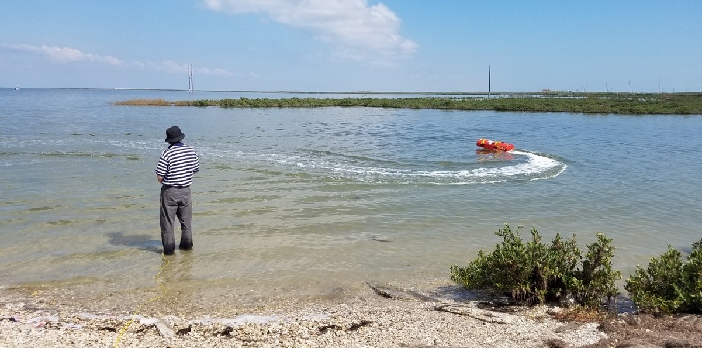

### Lab Work

In the last mission, the newly added [RFD900 Long-Range telemetry](https://ekrell.github.io/rfd900x/) was working, 
but near the end of the trial I was experiencing EKF errors.
I had previously encountered EKF errors and [fixed them](https://ekrell.github.io/solved-ekf-variance-failsafe/) by securing the Pixhawk and compass/GPS module. 
The error occurs when the sensors disagree, which is bound to happen if they shift from their calibrated positions. 
I suspect that this occurred again because of installing the new telemetry module, likely bumping the other sensors. 

I secured them more tightly within the pelican case and recalibrated. 
The size and shape of the vehicle makes it unwieldy and awkward to spin on all axes as required for calibration. 
The best calibration I could achieve was on the border of green (good) and yellow (questionable) in the score bar. 
I have not yet attempted the [alternative _MagCal_ calibration option for large vehicles](https://github.com/ArduPilot/ardupilot/pull/12863).

Thanks to advice from Adrian, creator ArduBoat vehicle [LOCARB](https://www.locarbftw.com/),
I have also disabled automatic gyroscope calibration  ([`INS_GYR_CAL`](https://ardupilot.org/copter/docs/parameters.html#ins-gyr-cal-gyro-calibration-scheme)) 
and raised the EKF tolerance ([`FS_EKF_THRESH`](https://ardupilot.org/copter/docs/parameters.html#fs-ekf-thresh)) to 1.0, _relaxed_. [Parameter archive updated.](https://github.com/ekrell/emily-usv/blob/master/emily_ardurover.params)

I also found that one battery was at 8 volts while the other three were over 11.5. A spare battery was available. 

### Field Work

At the lagoon, I was initially unable to arm. Most attempts would cause no indication of which prearm check failed, making it difficult to troubleshoot.
At one point there was a message concerning EKF. A quick web search suggested running a barometric pressure calibration and rebooting.
I did the barometric pressure calibration, but initially forgot about the reboot. Immediately, warnings about a 22-degree compass variance!
After fiddling with it for some, I rebooted the vehicle. It armed without issue and drove perfectly for ~15 minutes. 

[Video: donuts](https://www.youtube.com/watch?v=M8QvkmJyIko)

Next trial will be a waypoint-following mission, straying much further from shore. 
