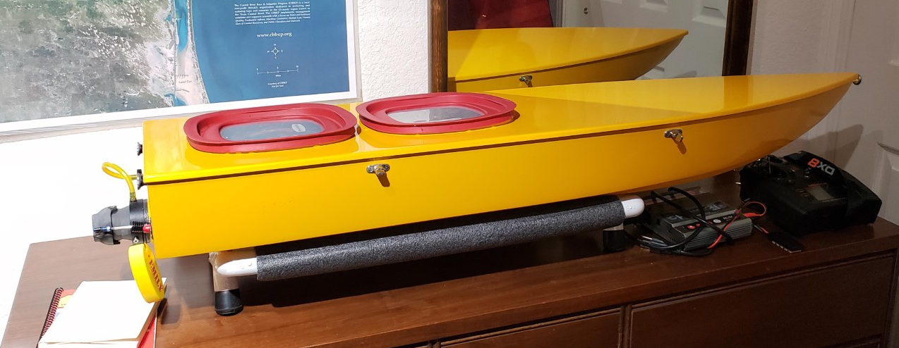

### Background

There is an [EMILY ERS](https://www.emilyrobot.com/) robot on loan to Texas A&M University - Corpus Christi (TAMUCC) by A&M College Station's [CRASAR](http://crasar.org/). This EMILY is called a Smart-EMILY, having been modified to support autonomous waypoint navigation. The CRASAR team outfitted the vehicle with a [Pixhawk Mini](https://docs.px4.io/v1.9.0/en/flight_controller/pixhawk_mini.html). I intend to get the EMILY going again, and using it for my project where a surface vehicle acts an an autonomous exploring, generating its own data collection missions based on onboard data analysis. The first steps are to make sure I can control it with remote control and with autonomous waypoint following.

### Setup

Some time go, CRASAR needed their long-range radios ([similar model](http://store.jdrones.com/jD_RD900Plus_Telemetry_Bundle_p/rf900set02.htm)) returned. So I replaced them with the not-long-range [3DR telemetry modules](https://www.amazon.com/YKS-Telemetry-915Mhz-Pixhawk-Quadcopter/dp/B0196LF6PW), hoping they would be suitable for at least limited testing. I also noticed that the Futaba radio reciever was not connected to the Pixhawk and there were no loose wires within the Pelican case holding the Pixhawk and connected components. When CRASAR demo'd the EMILY, they used a gamepad so perhaps the Futaba RC was not being used. Ardupilot [recommends](https://ardupilot.org/copter/docs/common-joystick.html) having an RC backup even when using a Joystick, so I set up the [Spektrum DX8](https://www.spektrumrc.com/Products/Default.aspx?ProdId=SPMR8000) using the [Spektrum satellite reciever](https://www.spektrumrc.com/Products/Default.aspx?ProdID=SPM9645). We also have the [AR8000 8-Channel DSMX Receiver](https://www.spektrumrc.com/Products/Default.aspx?ProdID=SPMAR8000), but it will take more time to get setup correctly. The satellite is simply plug and play. 

While testing the radio, I noticed that the Pixhawk was often rebooting. Inspecting, I found that any slight movement of a wire into the Pelican case caused it to loose power for a moment. I repaired the loose connection. It seems to be maintaining a steady connection even when I jostle the boat around during compass calibration. 

The firmware on the EMILY's pixhawk mini was out of date, no longer supported by the most recent [QGroundControl](http://qgroundcontrol.com/). Choices were either to use an old QGroundControl or update the firmware. I opted for updating the firmware. First I tried the latest PX4 with a rover frame. I was unable to bind the Spektrum Satellite or get any RC working. Then I tried ArduRover firmware (in Boat mode), which was working as expected right away.

The final issue I had is a bit of an embarrassment. Steering was working perfectly but only a slight noise and no action occurred with the throttle. After a significant amount of time checking connections, Pixhawk and RC settings.. I finally found that the motor for throttle has two connections and one was unplugged. 

The next goals are to test manual RC control and waypoint navigation with the ArduRover firmware. 

