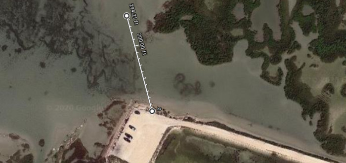
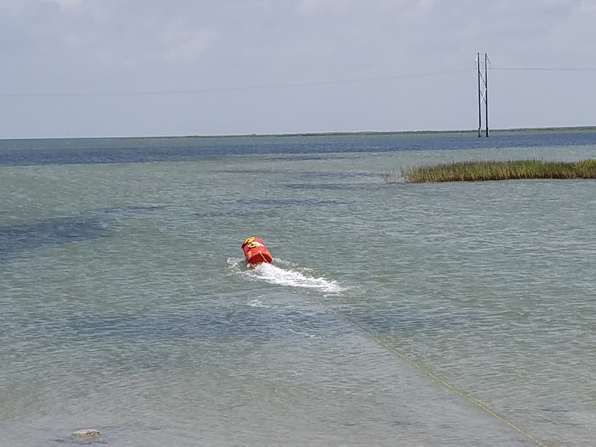
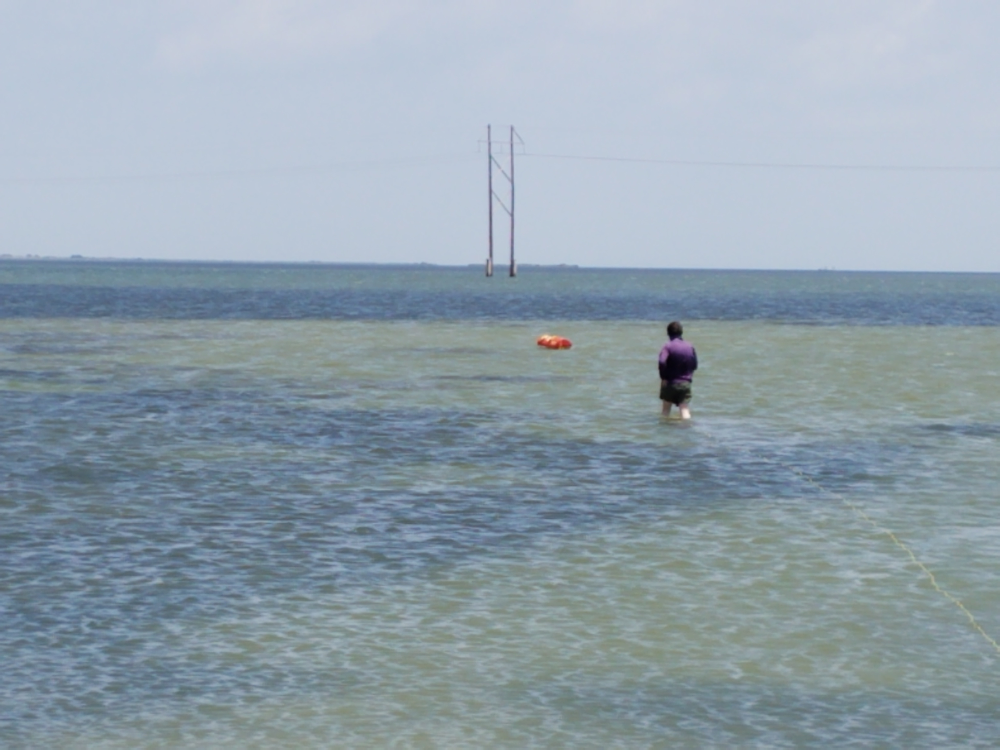
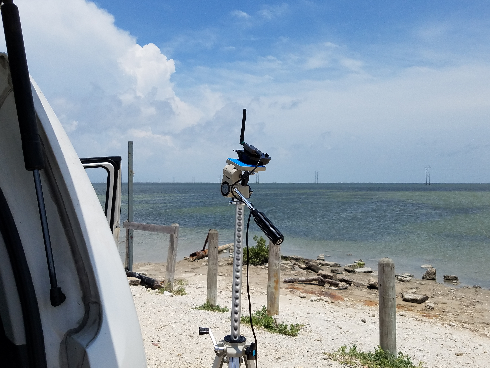

### Overview

This afternoon, I took the EMILY out for a quick test in the Laguna Madre (27°38'28.5"N 97°12'09.7"W).
As described in the last post, the EMILY had sat languishing for some time and without all equipment present. 
A few steps were needed to get the vehicle ready. 
So this test is merely to see if the EMILY is sufficiently operational given the preparations I made.
A tether was attached to the EMILY so that it could not escape if connection was lost. 

[EMILY control video](https://www.youtube.com/watch?v=uAws3_yPzGU)

I arrived around noon at the site shown above, launching EMILY from the dot shown on the white parking region.
The ground control station was simply my laptop, with the RF telemetry dongle raised with a tripod.
EMILY was pushed about a foot out into the water and manual RC control was used to manipulate the robot. 
The steering and throttle both performed as expected. 
The EMILY can quickly gain substantial speed, but is relatively maneuverable. 
Certainly the marine environment is a challenge. 
Typically I intend to cruise along slowly with the EMILY for data collection tasks, 
but turning requires more throttle that I expected to combat the current. 
The work I have done in energy-efficient path planning can be put to the test. 

### Issues

While the EMILY was quite easy to control and there were no issues with the Pixhawk disconnecting,
there were issues with maintaining RC control over the EMILY.
These issues appeared to fall into two categories: radio range and EKF error. 

First, the communication with the GCS was lost whenever the EMILY went sufficiently far from launch. 
In the map, I have a line going out ~300 feet from the launch. Here, the EMILY would consistently lose connection. 
I did not set return to launch, so it would simply drift away and I had to manually retrieve it. 
Once it was within range, I could arm it again in the GCS back on shore. 
Clearly this radio range is insufficient for any meaningful applications. 
Users report >1000 feet with this telemetry setup (for drones).
Need to look into extending this. 

Second, after a minute or two of controlling, the GCS would report high EKF error and automatically switch to hold mode.
When this occurred, I was required to wait a bit before I could re-arm and regain RC control. 
This seemed to occur mainly when increasing the throttle.
The boat's bow would rise considerably and perhaps the substantial pitching affected it. 
Was always able to regain control, so it does not seem to be related to radio range.
Perhaps in-field calibration will help. Somehow, this will need to be taken care of for reliable use. 

Given the issues with maintaining control, I did not attempt autonomous waypoint control.
Hopefully I can resolve these issues quickly so that I can focus on autonomy. 

### Post-mission

The marine tether is always a hassle to clean. 
Since I only used a fraction of it, I did not want to wind it up and have to unwind all of it since all would then be exposed to saltwater.
So I had only the length of rope used wound up and placed in a bag.
Somehow it emerged from the bag as a rat's nest that took always two hours to untangle in my back yard. 
