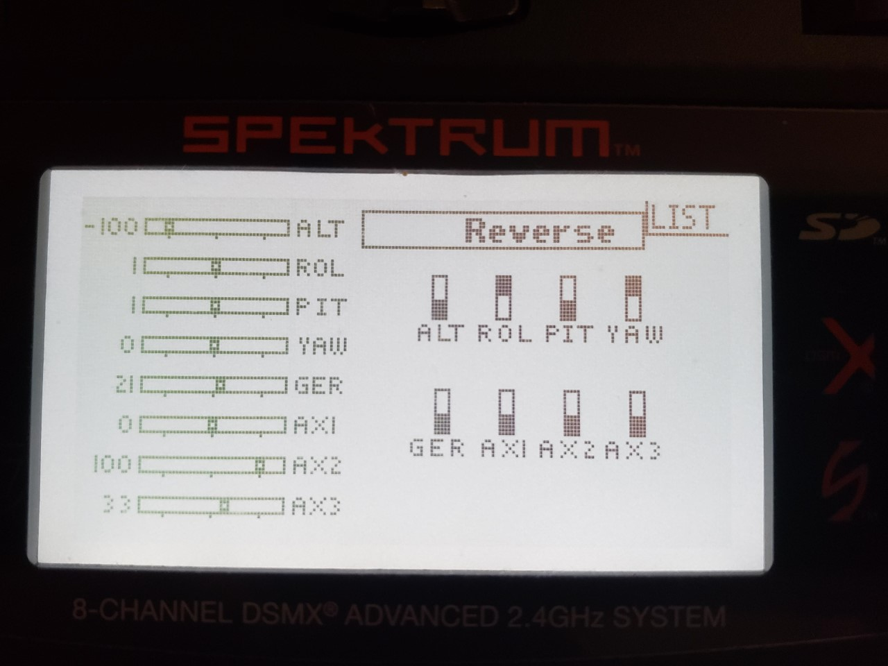
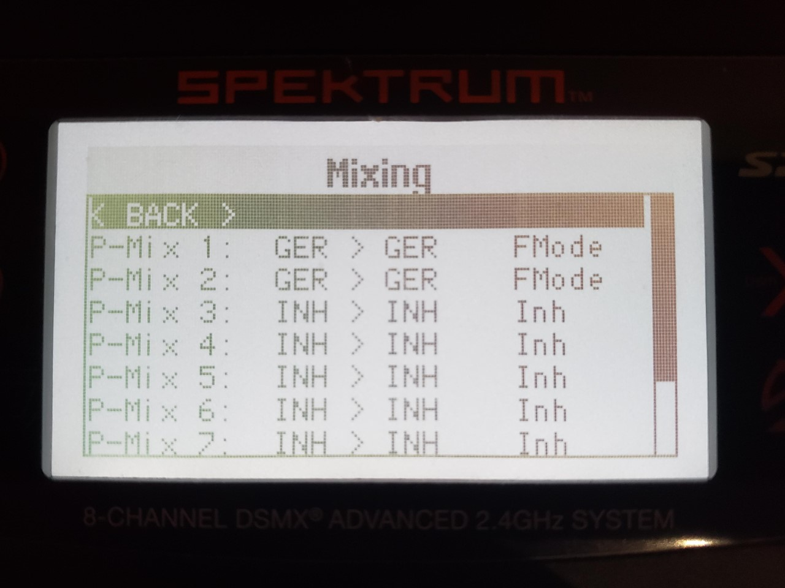
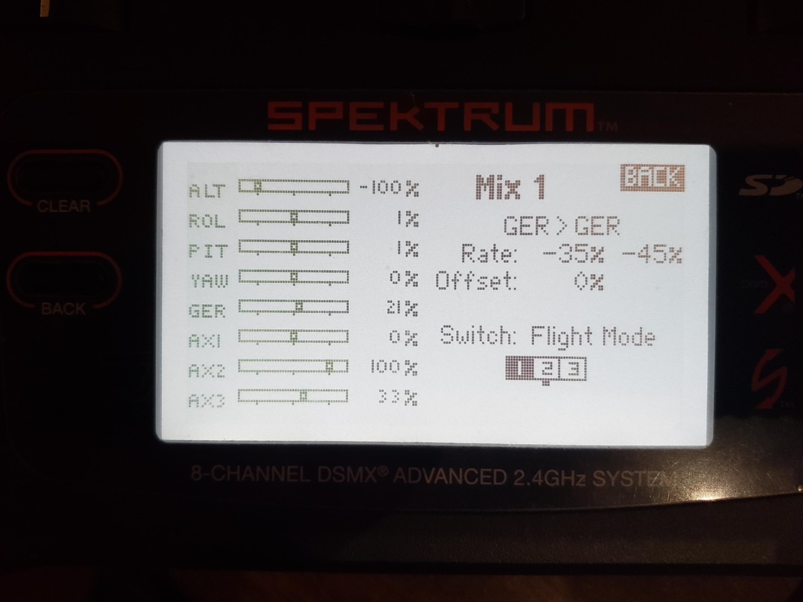
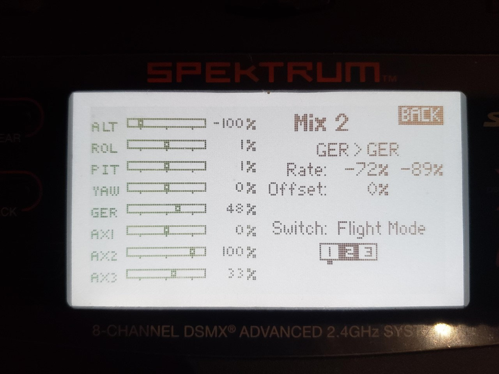
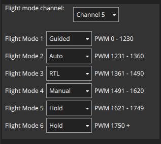
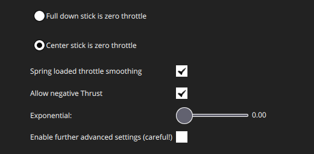

### Overview

While continuing to learn the capabilities of [ArduRover](https://ardupilot.org/rover/) and the [Spektrum DX8 transmitter](https://www.spektrumrc.com/Products/Default.aspx?ProdId=SPM8800), I have configured a few more features. I have read through the Spektrum DX8 manual and am still reading the ArduRover documentation. The Spektrum DX8 manual seems to describe all possible options, but assumes that the user is familiar with RC in general. As in, it explains what each function does but gives little to no motivation behind the function or examples of their use. Clearly its a professional product where the expectation is reasonable, but tricky for those like myself without RC background who just happened to have the transmitter available in the lab. This report describes how I set up each and then lists several remaining challenges to be met to have a operational autonomous [EMILY](https://www.emilyrobot.com.au/). 

### Progress

#### Reversed roll and yaw direction

On the first field trial, I realized that I had to turn left for right steering and vice-versa. In the radio calibration within QgroundControl, I could see that the controls were backwards for both roll and yaw. I corrected this by setting the `RC1_REVERSED` and `RC3_REVERSED` parameters. However, I did not really like having to reverse it in case there are side-effects of having it reversed from the RC transmitter than I am not aware of. It seemed cleaner to have a correct signal originating from the RC transmitter itself. So, I undid the ArduRover parameter-based reverse and found where I could do the same within the Spektrum DX8 transmitter. Its trivial to do, but only if you realize that clicking on `Travel` within the `Control Setup` screen allows scrolling through different options to setup.

`Function List` → `Control Setup` → `Reverse` → Flip the direction on `ROL` and `YAW`. 

#### Setup switching between 6 flight modes with transmitter

ArduPilot allows you to associate switch positions on the transmitter with flight modes (i.e. manual, hold, auto, …). There are six slots available to set, but the most choices available on any Spektrum DX8 switch are three. At first, I thought you would use one switch to cycle between three and a second switch to cycle between the remaining three. However, how would it disambiguate which mode to be in with two active switches? So, I found that the recommended way to enable all six is to use a two-option switch to select with half are available to the three-option switch. So, you end up with 2x3 equals six options. The setup is a bit convoluted, but I followed the steps in the [ArduRover documentation](https://ardupilot.org/rover/docs/common-rc-transmitter-flight-mode-configuration.html#spektrum-dx8-alternate-method) and it worked. Not all the words were identical between the documentation and my transmitter, but it was easy enough to guess at what to do. 

Basically, you use channel mixing which allows one channel to control another. So, you setup the GEAR stick (switch A) to behave differently (output different signals) depending on the Flight Mode stick position (switch B). 

Create two channel mixes:

Channel mix 1: 

Channel mix 2:

ArduRover setup:

#### Gamepad setup

I can also control the vehicle with a gamepad (Logitech Dual Action) using ArduRover’s joystick support. I previously thought this was not supported with ArduRover since I did not see the Joystick options. I learned later that the gamepad must be connected before launching QGroundControl. Once I did that, it was easy to set it up. The main thing to consider is that the idle position of the gamepad’s analogue sticks is center not down. So I had to set an option to indicate that the center position is zero throttle. 

It is good to have an alternative to a radio controller for manual control. I am currently experiencing very limited range with both the radio dongles (GCS) and the Spektrum remote satellite receiver. However, increasing the GCS range should be easily done with the long-range radios that I expect to purchase. Since the joystick is via the GCS, I can get long-range manual control. 

#### Downloaded offline maps

During the last field exercise, I setup an autonomous mission. But setting the waypoints was challenged by the lack of a map since I was without internet connection. So, I used QGroundControl to download offline maps of the local area. 

### Todo 

These remaining steps are to complete an operational EMILY. I mean, the basic components will be in place to then start adding the various sensors and companion computer setup that is the actual purpose of the project. 

- Better compass calibration
	- After calibrating, QGroundControl reported _medium_ quality
	- Frequently forced to enter _hold_ mode during manual control because of “high EKF variance”
- Autopilot tuning
	- The autopilot works, but controls terribly since its tuned for a default rover instead of a wide-turn-angle boat
- Longer radio range
	- Both the Sik radio and Spektrum receiver loss communication within just under 300 ft.
- Voltage monitor
	- Currently have no idea how much battery is remaining. I am forced to be extremely conservative and do quite minimal testing. I know the EMILY was initially setup for monitoring through the Futaba RC transmitter, but I’m not sure how the Pixhawk conversion affected this. 
	- I have a Spektrum telemetry module, but I don’t know how to wire it. I seem to be missing the required cable. 
