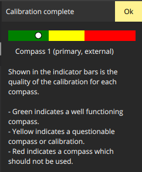
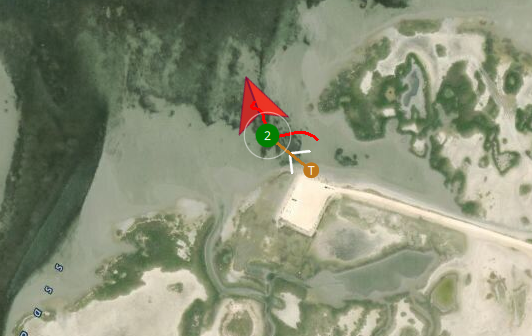
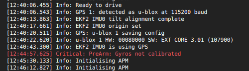

### Summary

No longer experiencing “high EKF variance” failsafe that plagued previous field trials. In short, the GPS and Pixhawk were not sufficiently secure in their case and their shifting over time made their compasses disagree. 

### Details

I have solved an issue that has been present for all the previous field trials. As I’ve previously described, I kept getting errors for “high EKF variance”. Whenever this occurred, Pixhawk would switch to hold mode. This was followed by ~30 seconds of “initializing” before I could regain control. In my last post, this substantially limited my ability to control to vehicle. 

Yesterday, I was completely unable to get any control of the vehicle, in manual or auto modes because of this. Since the wind was much worse that day, I thought that was the environment at play. As in,  I was interpreting the EKF variance as the variance between expected pose estimate w.r.t the command and that observed in the environment. But, thanks to [help from ArduRover developer Peter Hal on the ArduPilot forums](https://discuss.ardupilot.org/t/solved-high-ekf-variance-failsafe-cannot-reliably-use-manual-or-auto-modes/58466/3), I was put on the right track in easily fixed it. Here, variance is between sensors. So, there is an estimate from the Pixhawk’s internal compass as well as the  compass on the GPS unit. When these disagree, you get the EKF variance, which makes sense. The problem is that the Pixhawk and GPS unit were not well-secured within the Pelican case inside the boat. So, each time I use the boat they shift a little more and the variance increased until they became unusable. 

So, I used zip-ties and jammed them tightly in the case. At this stage, I don’t want to actually secure the devices in a Pelican-case modifying way since (1) it is CRASAR’s boat not ours and (2) this might not be the final position. For the first time, the compass calibrated was “good” instead of “questionable”.

Calibration results:

Quick field test auto mission. The green line shows the boat turn toward the waypoint, reach it, then drift for a few minutes with the current since I was not in a loiter mode. I kept the waypoint mission extremely simple since I was only interested in the EKF variance issue. I still need to tune the controller for better navigation with more complex waypoints. 

Also, I temporarily ran into another issue. So far, I had disabled all pre-arm checks. I believe this was done by CRASAR as well. I thought I might be missing important feedback so I enabled them. However, it would not arm if I turned on the Pixhawk while it was in the water. The error was “gyros not calibrated”. I found a [discussion](https://discuss.bluerobotics.com/t/gyro-not-calibrated-warning-loss-of-control/1179/8) where another user had the same experience with an underwater vehicle. Basically, on boot a check is performed that assumes the vehicle is still. This is never the case for a marine robot, so that particular pre-arm check should be disabled for a boat. 

