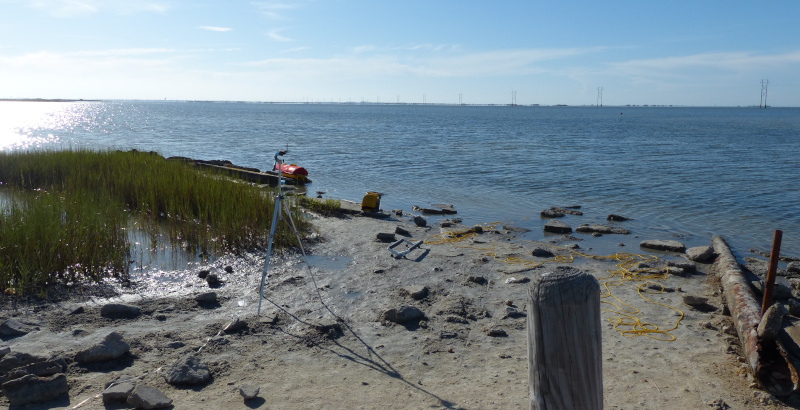
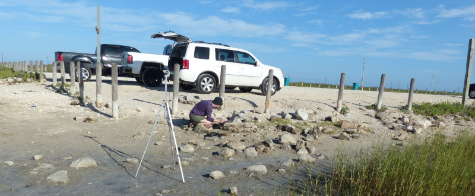
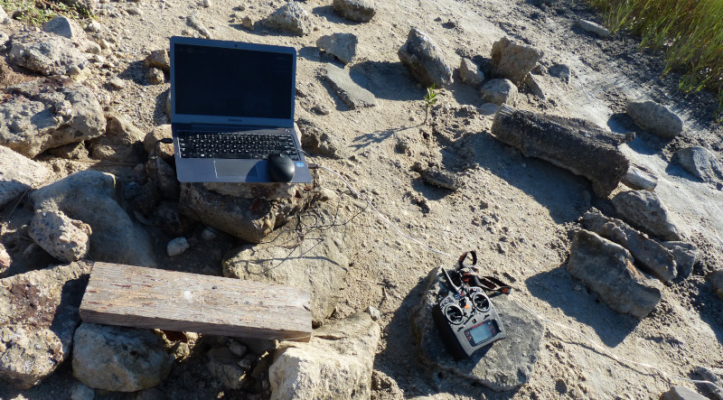
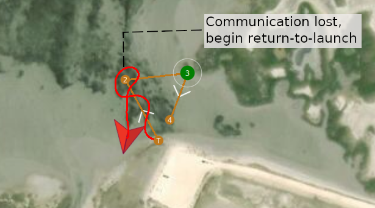
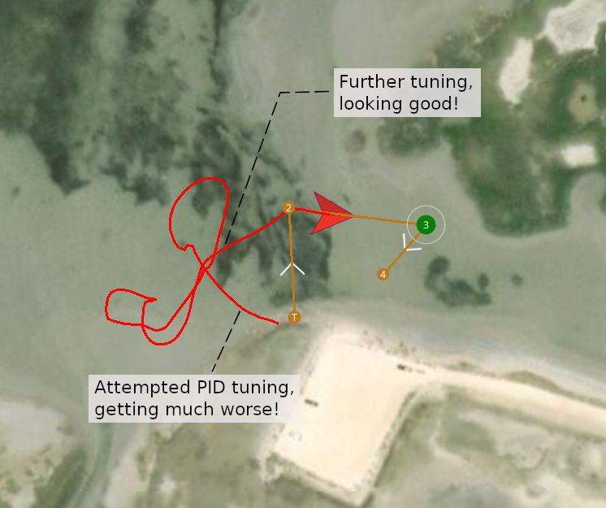
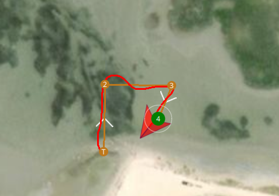
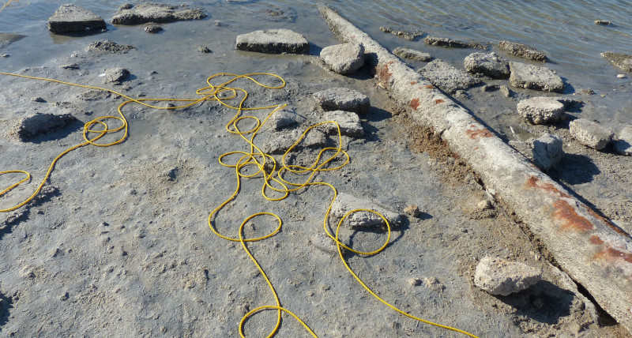

### Summary

Previously, I have reported that the waypoint following (AUTO mode) has been unusable because of extreme oscillations along the path. Today, I tuned the PID values by running several trials in the Laguna Madre. While I could fine-tune it further, the waypoint following is now quite reasonable. 

[Emily Ardurover parameters file, after PID tuning.](https://github.com/ekrell/emily-usv/commit/5ce96a17d08cac04ba79dfdfb0b4b528ed6315b8#diff-ee26e64c361a802879b2499ad32cece4)

### Setting up

Today’s launch was just a few feet away from my [usual site](https://ekrell.github.io/autonomy-test/), a popular kayak launch spot. So popular today that I had to move to a slightly less convenient location. I found that, due to the limited RF range that I previously mentioned, I could not operate from the vehicle; the GCS (laptop + tripod with radio dongle) was out on the sand. Perhaps I should bring a beach chair. 

### PID Tuning

I have experience with path-planning, computer vision, etc, but my algorithms are typically high level: they output waypoints and leave the waypoint-following to a lower-level controller. So, I have only ever had a very surface-level concept of a PID controller. In fact, I accidentally wrote a P regulator while programming a basic waypoint-follower in the [Gazebo](gazebosim.org) simulator a couple years ago. Recently, I have experienced several situations where knowledge of control theory would be useful, and I expect that I will be applying it in the near future for various projects. I read the tutorial for [basic PID tuning for ArduRover](https://ardupilot.org/rover/docs/rover-tuning-steering-rate.html), but I have also learned a lot about it from a control theory standpoint from a very good series of lectures [Control of Mobile Robots](https://www.youtube.com/playlist?list=PLp8ijpvp8iCvFDYdcXqqYU5Ibl_aOqwjr). Interestingly, [QGroundControl](qgroundcontrol.com) does not have an interface for tuning when using ArduRover (unlike [Mission Planner](https://ardupilot.org/planner/)), so I had to modify the parameters directly. 

First, here is an initial attempt to follow waypoints before tuning:

I did several trials, tuning the FF (Steering control feed forward gain), and P values as described in the [ArduRover documentation](https://ardupilot.org/rover/docs/rover-tuning-steering-rate.html). It actually took six trials to achieve a reasonable behavior, but it took a long time because of the complexity of running these trials. In short, the boat goes to waypoint 1 (hopefully), then looses radio connection while en route to waypoint two. I have it set for a return-to-launch on connection loss, but this relies on having a good controller setup... So I hope it gets closer (sometimes it goes the opposite way), before setting it to hold mode so that I can drag it in closer by the tether. After about an hour where the waypoint following was getting significantly worse, I put in the magic FF value  (1.0) and it started tracking perfectly. 

I pulled it back in and did another test to verify that my observations were no mere fluke. 

### Tethers

I need reliable, longer range communications so that I can get away from tethers. Eventually, the long-term autonomous missions I envision cannot be tethered. But currently, if I lose communication (between 200 – 300 ft), I can either hold or return-to-launch. The former requires someone (me) to go out and retrieve the vessel and the later is dangerous since there are frequently fishermen and beachcombers in the vicinity. 

