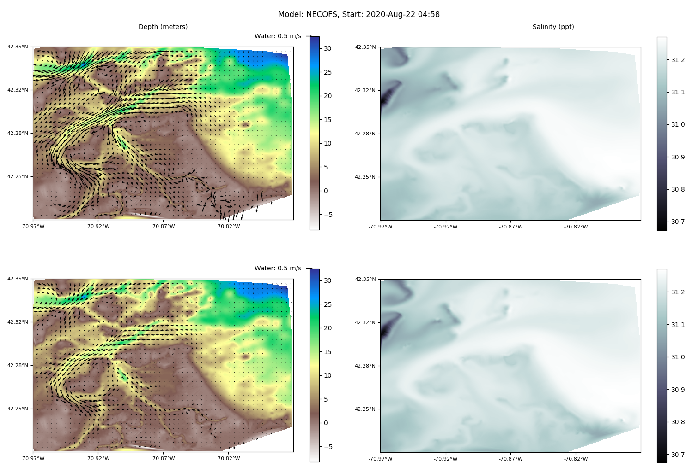

[Whelk](https://github.com/ekrell/whelk) is a repo of scripts for pulling water surface data from servers and converting them to multi-band forecast rasters where each band is a discrete time index.

I have implemented a number of path planners for surface vehicles for energy-efficient planning that takes the water currents into consideration.
This is only useful if you have some predictions of the water currents. 
There are a number of sources that provide water current forecasts, but typically the resolution is insufficient for useful inshore planning.
Or, often they don't even include inshore bays and lagoons. 

I have previously discussed that [Boston Harbor](https://www.nps.gov/boha/planyourvisit/maps.htm) presents a very nice path planning environment since it has both numerous obstacle islands and suitable water current forecasts.
For all of my Boston Harbor path planning, I have been using a pair of rasters that I generated from [NECOFS](http://fvcom.smast.umassd.edu/necofs/) data about three years ago. 
I intend to test my planner in a variety of weather conditions, so I made a small utility for generating the rasters given a start time and range for selecting the hourly bands.
The goal is to find test cases of typical weather, highly dynamic, and stormy. Since it is inconvenient to generate these rasters and manually check them with QGIS,
the script can produce a plot of all the bands which is much more efficient for exploring the data. Below, each row of the chart is one hour's forecast. 

