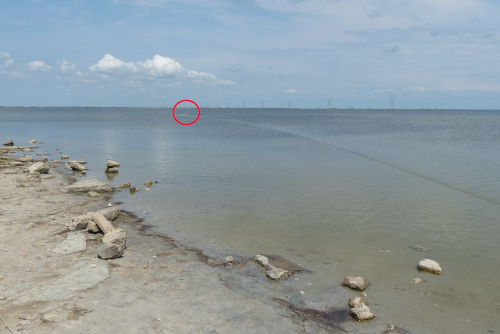
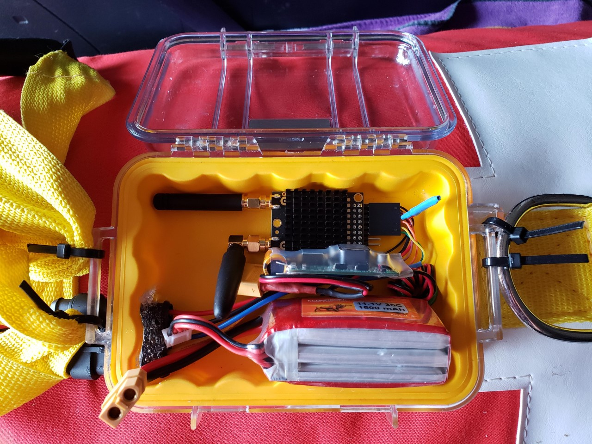
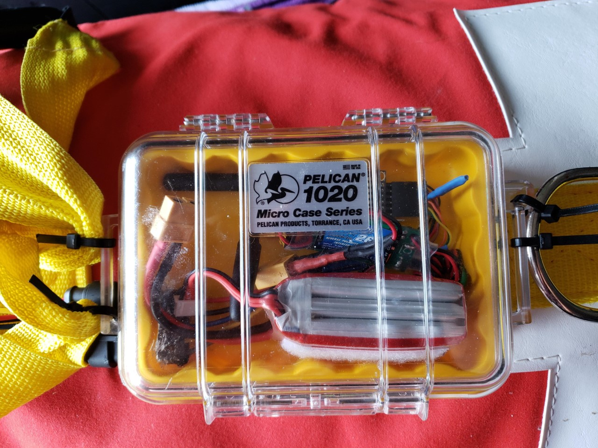
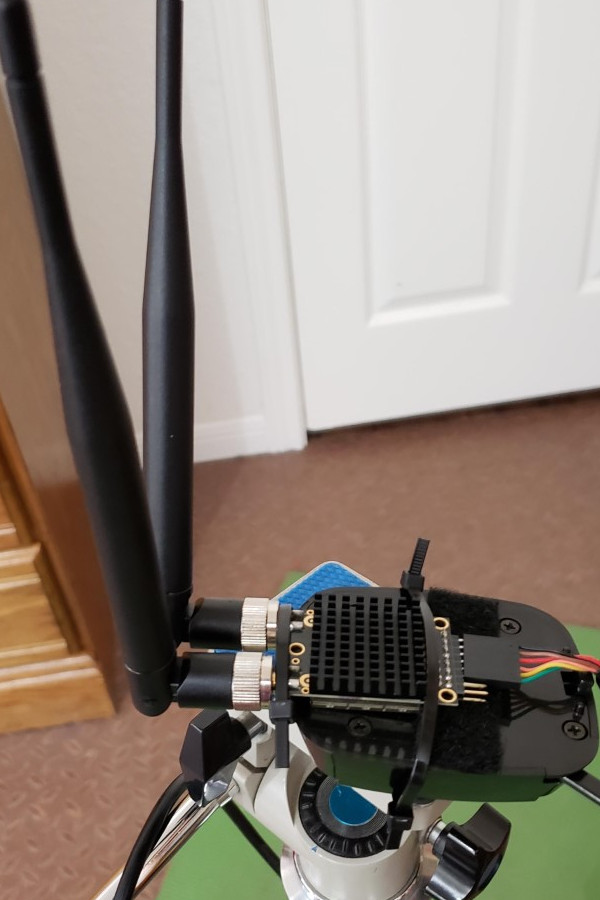
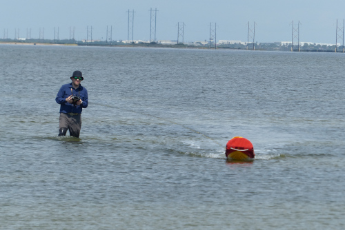

### Overview

I have installed the [RFD900x long-range telemetry](http://store.rfdesign.com.au/copy-of-rfd900-modem-bundle/) and never experienced any connection issues within the length of the tether: ~250 meters.
I expect it to have much longer range, but this initial test confirmed successful radio integration. 
A thunderstorm was approaching, so I had to wrap up the field test. 
The previous telemetry module was often losing connection even within 12 feet, so just a stable connection to the ground station is a huge improvement. 

### RFD900x 

As [previously discussed](https://ekrell.github.io/components/), the [SiK telemery](https://ardupilot.org/copter/docs/common-sik-telemetry-radio.html) has not provided usable performance. I have once achieved ~300 meters, but frequently experience "connection lost" in 12 - 20 ft. 
I expect that the poor performance is influenced by any of the following:

1. Based on the antenna connection, appears to be a knock-off since it uses [SMA instead of RP-SMA](https://discuss.ardupilot.org/t/antenna-to-extend-range-on-3dr-telemetry/998/3).
2. The dongle is placed down in the hull, almost touching the GPS and Pixhawk
3. It has limited range from the start

As an alternative, the lab has purchased [RFDesign's RFD900x long-range telemetry modem pair](http://store.rfdesign.com.au/copy-of-rfd900-modem-bundle/).
This is module is very [commonly used](https://ekrell.github.io/components/) on ArduBoat builds. 
All three of the above issues are addressed. 

1. It is a high quality product from [RFDesign](https://irlock.com/collections/telemetry/products/rfd900-telemetry-bundle)
2. The radio is now positioned on top of the boat, running a wire through the hull
3. ["Long range >40km depending on antennas and GCS setup"](https://irlock.com/collections/telemetry/products/rfd900-telemetry-bundle)

### Installation

Setup is based on [these steps](https://mikeisted.wordpress.com/2018/08/25/rfd868x/), except I also connected the ground wire after consulting with the folks at the [ArduPilot forums](https://discuss.ardupilot.org/t/solved-wiring-rfd900x-to-3dr-pixhawk-mini-4-pin-telem-port/60434/8). Of course, everything must be waterproof. 

Components I used: 
- [RFD900x long-range telemetry](http://store.rfdesign.com.au/copy-of-rfd900-modem-bundle/)
- [Pelican 1020](https://www.amazon.com/Waterproof-Case-Pelican-1020-Micro/dp/B001Q21Y0G/ref=sr_1_1?dchild=1&keywords=pelican+1020+yellow&qid=1598129304&sr=8-1) to waterproof the module
- [Floureon 3S 11.1V 1500mAh 35C RC Lipo Battery with XT60](https://www.amazon.com/Floureon-1500mAh-Battery-m4-fpv250-Shredder/dp/B00SGYXD4M/ref=cm_cr_arp_d_product_top?ie=UTF8)
- [Turnigy 5A (8-26v) SBEC](https://www.amazon.com/UBE-SBEC-Turnigy-8-26v-Lipo/dp/B08GB4F61B/ref=sr_1_7?dchild=1&keywords=26v+bec&qid=1598129371&sr=8-7)
- [Marine cable connector](https://www.amazon.com/Waterproof-Electrical-Connector-Automotive-Connectors/dp/B07G9GH3KT/ref=sr_1_4?dchild=1&keywords=5+wire+marine+connector&qid=1597540609&s=automotive&sr=1-4)
- [Marine sealant to waterproof the opening made for the cable](https://www.amazon.com/Sashco-13013-2-Sealants-Adhesive-5-Ounce/dp/B0012DIUYW/ref=asc_df_B0012DIUYW/?tag=hyprod-20&linkCode=df0&hvadid=168238778532&hvpos=&hvnetw=g&hvrand=18199015236025956824&hvpone=&hvptwo=&hvqmt=&hvdev=c&hvdvcmdl=&hvlocint=&hvlocphy=9028157&hvtargid=pla-332215549834&psc=1)

The radio can be directly connected and powered from a Pixhawk, but this is not recommended. 
The RFD900x pulls a lot of power and can lead to unstable power for the Pixhawk. 
I tested it with the [Pixawk mini](https://docs.px4.io/v1.9.0/en/flight_controller/pixhawk_mini.html) and the mini could not even boot; it would simply light up, beep, die, and repeat. 
Thus, I am powering the module separately with a Lipo and BEC. 

The included Pixhawk-compatible cable is not for Pixhawk Mini. The Pixhawk accepts Power, ground, Tx, Rx, CTS, and RTS. 
The Pixhawk Mini does not support flow control with clear-to-send (CTS) and request-to-send (RTS). 

The RFD900x, battery, and BEC are in a waterproof pelican case on the top of the EMILY. 
A hole is made in the Pelican case for the 5-pin marine connector. 
I have a soldering iron dedicated to melting holes in plastic containers. I recommend a cheap/old soldering iron that you are not attached to. 
We start with 6 pins at the source and end with 3 at the Pixhawk (Tx, Rx, ground). 
However, I did not want to completely remove the ability to connect to a device that could use flow control.
So this is why I chose a 5-pin connection from the pelican case.
The RFD900x can get hot, so I do have concerns with the heat dissipation within the case. [However, I am not the first to do so](https://community.emlid.com/t/does-anyone-make-a-waterproof-case-for-reach-devices/2211/9?u=bide). 

On the Pixhawk side, a long FTDI cable to the Pixhawk mini end with a matching 5-pin connection, but with only three pins wired. 
The CTS and RTS are terminated and unused. 

Quick wiring sketch:

Base station module is simply mounted on a tripod and connected to laptop with included FTDI to USB cable. 

### Field test

I took it to the [usual Laguna Madre site](https://ekrell.github.io/PID-tuning-EMILY/), and sent it out under manual control. Since the RC range is less than the long-range telemetry, 
I had to wade with EMILY. We went about ~250 meters, which is the length of the tether. There were no issues with "connection lost" from 
QGroundControl, which has plagued all previous missions. The only problem was EKF errors, since the telemetry installation involved some
repositioning of components and I forgot to re-calibrate. Given the EKF issues make the RC a bit unstable, still not quite ready to go untethered.
Also, there was a storm looming and the thunder started almost right when I got back home.
I would like to do further range testing by putting the Pixhawk and RFD900x on my family's actual boat. We can leave a laptop running QGroundControl in the car and see when it looses connection. 

### Remaining issues

**Extending radio control**

Now, the range is limited by the Spektrum RC which reliably gives ~200 meters. 
Even if I could increase the range through better placement of the receiver, (1) it will never come close to the RFD900x and (2) I don't want two communication systems. 
One option is to [route RC through the RFD900x](https://discuss.ardupilot.org/t/telemetry-with-ppm/14107/7) and another is to use a gamepad/joystick with QGroundControl instead.
The latter option is trivial to setup, but is reported to have more lag. In general, my research is about autonomy, but practically manual control is great for testing and I expect to be testing path planning algorithms before working on obstacle avoidance. 

**Return of the EKF error**

If I am correct, this is a simple fix. I previously solved EKF variance issues by securing the placement of the Pixhawk and GPS. 
When repositioning the radio, their placement shifted somewhat and so I was experience the EKF failsafe errors again. 
Pretty sure I need to recalibrate, which is not easy with such a large and unwieldy vehicle. 

