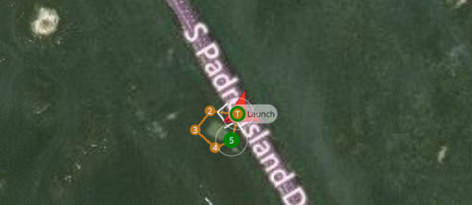
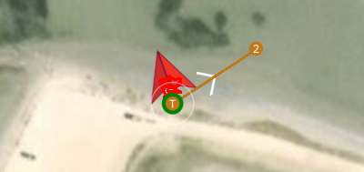

### Summary

Today’s mission visited two sites in the Laguna Madre. The purpose was to test three ArduRover modes: Return-to-Launch (RTL), Smart Return-to-Launch, and Loiter. [RTL](https://ardupilot.org/rover/docs/rtl-mode.html) travels directly toward wherever the vehicle was initially launched or a set home position. [Smart RTL](https://ardupilot.org/rover/docs/smartrtl-mode.html) backtracks the way it came, which is useful if the straight-line path to get to the launch has obstacles in the way. [Loiter mode](https://ardupilot.org/rover/docs/loiter-mode.html), which is available when ArduRover is configured to use a boat frame, holds the position and orientation. Unlike hold mode, loiter will actively correct itself. This is critical for maintaining position for a boat which will otherwise drift with the current, be tossed by waves, etc. 

Various factors complicated the mission, and it was difficult to investigate the modes. Only loiter mode was successfully tested, if in a limited capacity. Loiter mode appeared to be effective. However, the mission was plagued by frequent interruptions with _communication lost_, sometimes within 20 feet!. At another time, the boat was able to reach a waypoint ~350 ft away, right before simultaneously losing communication and getting stuck in shallow water. I need to review the failsafe mode setup, because I have the parameter [FS_ACTION (failsafe action)](https://ardupilot.org/rover/docs/parameters.html#fs-action) set to RTL, but the boat always just enters hold mode on communication loss. Glancing at the [failsafe documentation](https://ardupilot.org/rover/docs/rover-failsafes.html), I think I have only radio (remote control) failsafe enabled, not telemetry (GCS control).  I never noticed losing remote control, only telemetry. Manually setting RTL appeared to have no effect; eventually I realized the area was extremely shallow and is at some times an island. I moved to my [usual test site](https://ekrell.github.io/PID-tuning-EMILY/), but it was crowded with families so I had a very small, shallow area to work. Even though I was within 20 feet of the tripod-mounted [SiK telemetry](https://ardupilot.org/copter/docs/common-sik-telemetry-radio.html), I was getting frequent communication loss. Fortunately, the [long-range telemetry pair (RDF900+)](http://store.jdrones.com/jD_RD900Plus_Telemetry_Bundle_p/rf900set02.htm) has been ordered.

### Attempted RTL along the J.F.K. Memorial Causeway

I first tried here because my dad had noticed that the usual spot for EMILY testing, also one of our favourite kayak launch spots, had been quite crowded lately. There is only one really good spot there for launching and keeping the tether out of vegetation. So, I tried along the Causeway, where there is a sparsely-populated, long stretch of access to the Laguna Madre. Since the goal was to test RTL, I created a sequence of waypoints that would cause the boat to go away from the shore. 

EMILY reached waypoint 3 without issue, then almost immediately lost connection. I was expecting it to initiate RTL, the set failsafe action. However, the boat did nothing. I was surprised since previously a communication loss prompted RTL. 

The reason I was testing RTL was not to check if it would enter that mode, but because previous RTL behavior was observed before [PID tuning](https://ekrell.github.io/PID-tuning-EMILY/). I wanted to verify that with PID tuning, the RTL would perform properly. Manually forcing it to RTL was also acting weird. I would pull on the tether to get in in range to manually enter the mode. The boat would enter the mode without any errors, but was immobile. I eventually had to drag it to shore by the tether, occasionally testing RTL. I realized the problem which I switched to manual to drive the boat to shore. I could see a second of throttle then it would stop; the water was so shallow that the boat was actually stuck. I gave up at this site. 

### Attempted RTL and Loiter at the second site

Next I went to the parking lot that juts out into the lagoon, where all previously reported EMILY field tests have taken place. Here, I was having extreme communication errors, unable to maintain a steady connection even when the boat was only ~12 ft away. It was hard to get anything accomplished in such conditions. I was only able to manually drive the boat out for a few feet to test loiter mode. The water conditions were unusually calm and the current had almost no effect on the vehicle. So I pulled it in various directions by the tether. Each time, it would exit its loiter radius and reposition. While not a prolonged test, it suggests that loiter is working fine. 

However, attempts to test RTL were always met with telemetry communication issues. Also, the telemetry issues take far too long to recover from. Usually on regaining a connection, the log mentions “Initialing APM” several times, and it usually undergoes a tedious sequence of “EFK error”, “EKF failsafe”, and “EKF failsafe cleared” that can take over 30 seconds. I am determined to put all further EMILY testing on hold until I have installed the long-range telemetry pair. 

