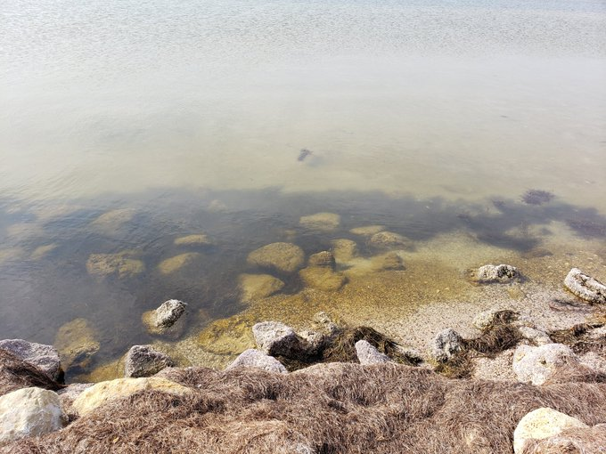
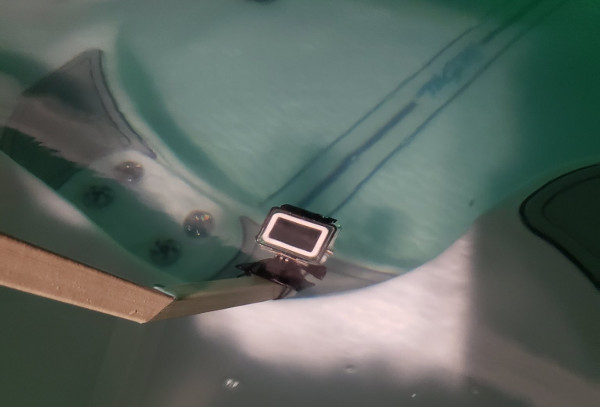
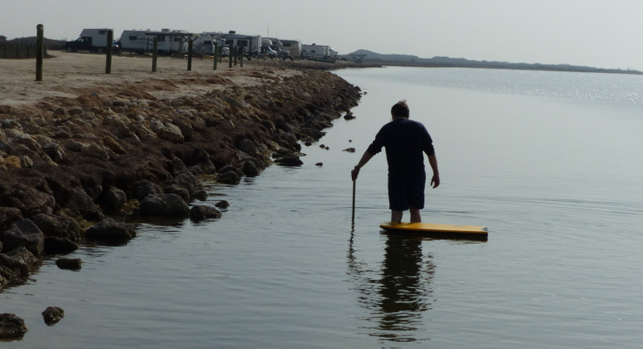

### Lab Work

Now that the vehicle is more or less operational, I am working on the video system. 
While the ultimate goal is for the vehicle to process the optical stream in real time to enable data-driven behavior, 
the initial work is to simply collect and analyze data. There is a lot of work that can be done in image processing, machine learning modeling, etc
before the vehicle has to have a complete online image processing setup. 

The next step is to simply mount the lab's GoPro and collect data. I intend to collect data over a coverage area that I can compose into a mosaic,
place the mosaic in simulation, and test out data-driven behaviors. Basically, the simulated camera will be aimed at the mosaic as if collecting that data again. 

Using a hollow rod and zip ties, I mounted the GoPro such that I can attach it to the boat.
I made this to be removable so that I can easily collect data from the EMILY or just from a manned boat or kayak. 
Since I am still working out a few last details on the EMILY, I am not quite comfortable with running an untethered autonomous mission. 
Specifically, I don't think I ever had success with perhaps the most critical behavior of all:  Return-to-Launch. 
But generating the mosaic can be done from any platform.

Last night I gave this a quick test in the pool. 
While not exactly needed for data collection, it would be nice to monitor the feed. 
So I was checking the streaming from the camera to the GoPro app. 
In short, the connection is lost almost immediatly on submersion. 
The ideal solution is to run a cable through the hollow rod up to a single-board computer. 
But [Alexis Guijarro has proposed some ideas](https://twitter.com/krell_evan/status/1353576752845565952) that are still in discussion. 

### [Field Work](https://youtu.be/IBDWzhMQxVA)

For a quick trial run, I took the mount out to Bird Island Basin, Padre Island to record some footage. 
I have seagrass videos recorded a few years ago, but I was interested in this location for future field trials. 
The appeal of the basin is that it is fairly shallow for a long time with plenty of grasses, rocks, etc to film. 
I had the camera mount tied to a bodyboard, just in case I accidently dropped it. 

Rather non-autonomous data collection: 

I recorded three videos that feature footage extremely close to shore (ankle deep) to further out (waist deep). 
The deeper footage (most of video 3) is extremely hazy, just able to differentiate sand and grass based on color. 

[Video 1/3](https://youtu.be/Pmoer8vI6v4)

[Video 2/3](https://youtu.be/S9ExKHNXIXc )

[Video 3/3](https://youtu.be/F_A5rqXYTgw)
