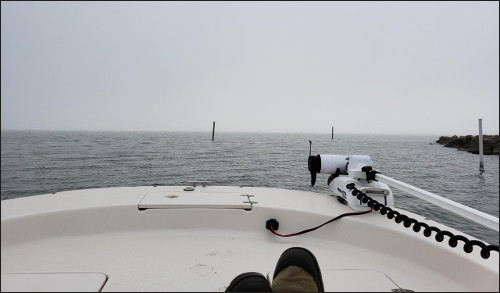
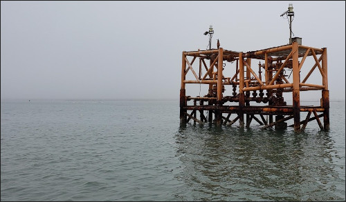
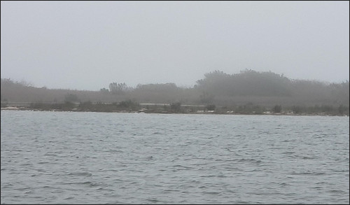
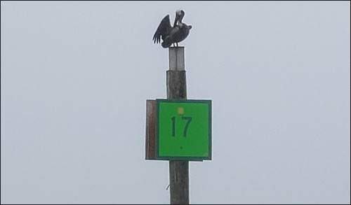
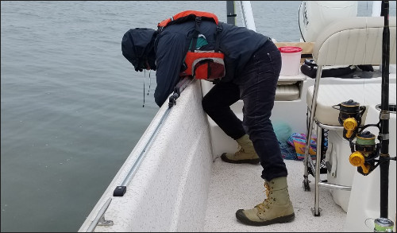
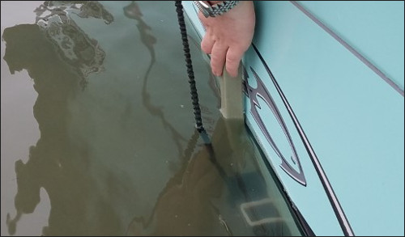
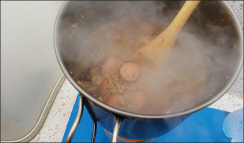
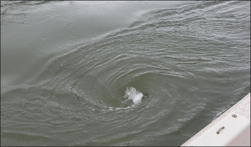

The transition from [wading](https://ekrell.github.io/Underwater-GoPro-Footage-Bird-Island-Basin/) 
to boating for data collection is an upgrade, even if the boat is not autonomous. 
Again, I am using a GoPro to record seafloor-facing underwater footage in the shallows. 
This data will be used to (1) generate a mosaic to place in a simulator for testing autonomous data-driven behaviors 
and (2) develop ML models for classification, clustering, and novelty detection. 

This mission was actually a combined fishing and data collection trip with my parents in their boat. 
Eventually I will conduct rigorous surveys in one or more regions to collect the data for the mosaic. 
For now, I am still getting a sense of the data quality that can be achieved despite the significant turbidity that characterizes the local waters.
Also, accessible shallow water sites with a variety of substrate characteristics are being noted for future missions. 
Launching from Bluff Bay Marina, we spent some time around the Humble Channel, Packery Channel and Intercoastal Waterway (ICW). 
A very pleasant day on the water, being quite chilly and with substantial fog. 

 

Along the ICW, the lagoon has numerous islands and flats. The channel is flanked by extreme shallows that are best navigated with a trolling motor.
I identified a site along the ICW with ~1 ft. depth around some islands (marker #17) where I could make out bottom details looking from the deck. 
Unfortunately the trolling motor was having some issues, so instead we just let the boat drift toward the islands for ~12 minutes while recording.
Two videos were recorded, interrupted only to make sure I was actually capturing details. 
I have not had success with streaming the GoPro over to my phone via WiFi if the camera is submerged,
so I have to manually check the recordings periodically to monitor. 
Of course the autonomous system will be integrated with a companion computer. 

To record, I simply held the DIY camera mount against the side of the boat. Any ideas for attaching the camera without modifying the hull?
I usually rely on zip ties, but the sheer sides don't offer attachment points. Not my most dignified pose. 

Drifting along the flats was easy, but getting back into the channel took effort. 
Without the trolling motor, my dad and I used poles to manually push ourselves out while fighting against the current. 
We would have collected a lot more data if the trolling motor were operational.
After that bit of adventuring, I cooked chili while waiting for my invitation from the [Explorer's Club](https://www.explorers.org/). 

## Videos

The good is that I can make out bottom detail. There is sand, small white shells, and grass clumps.
Unfortunately, the current was strong enough to cause the boat to speed along to quickly. 
I did not feel too fast on deck, but when the camera is inches from the bottom the vehicle needs to move very slowly to avoid motion blur. 
Blurred, the white shells still stick out against the sand background. But the seagrass clumps tend to blend it, making a green smudge. 

[Video](https://youtu.be/zUO7_6WC1Bc)
