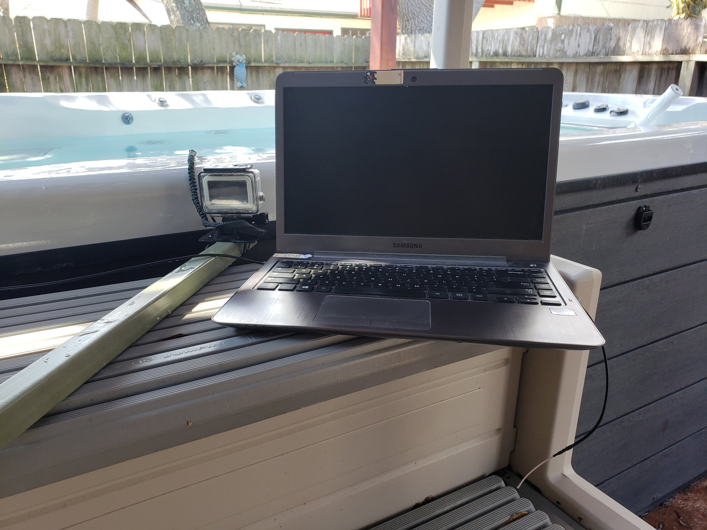
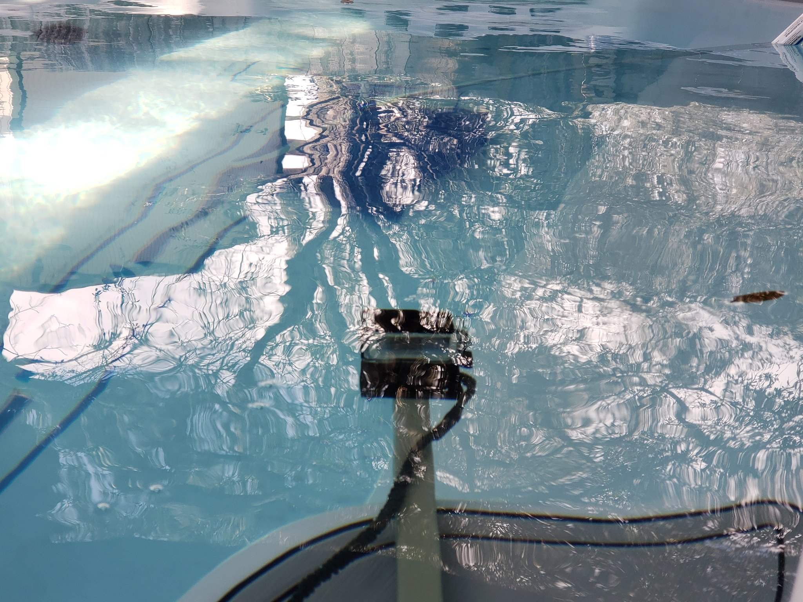
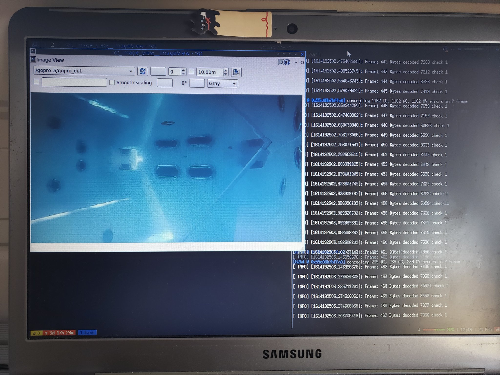
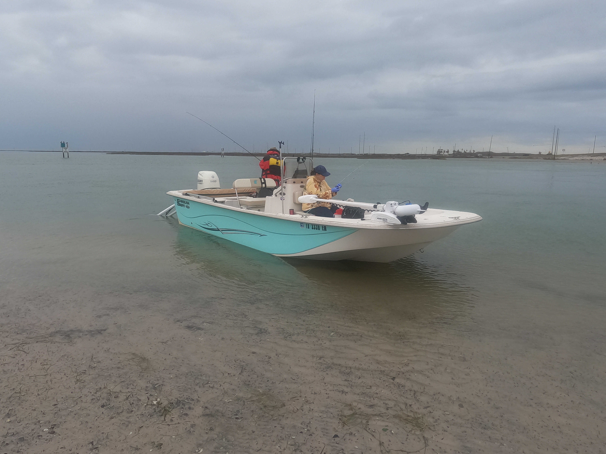
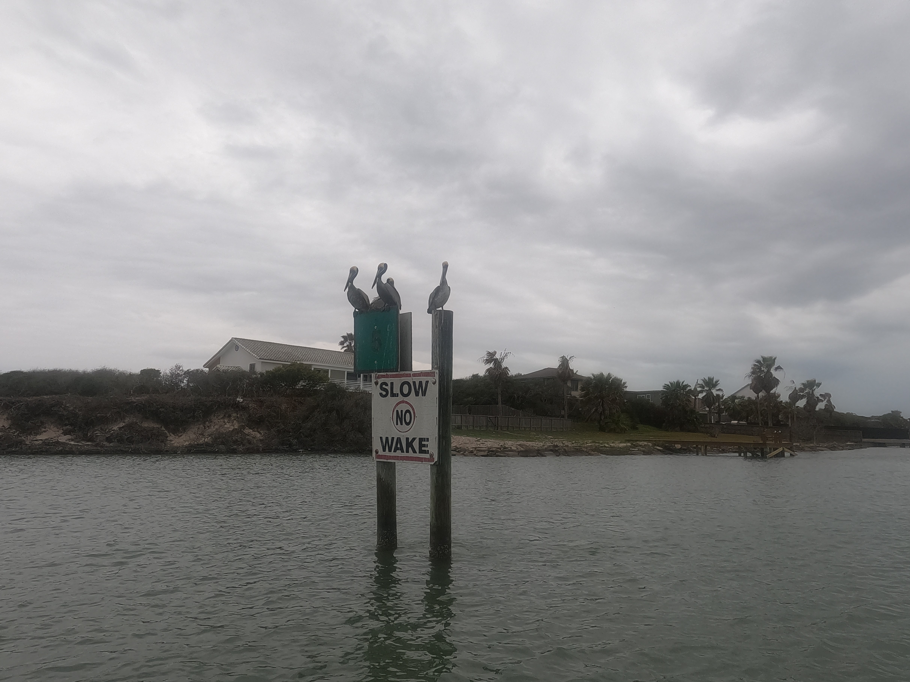
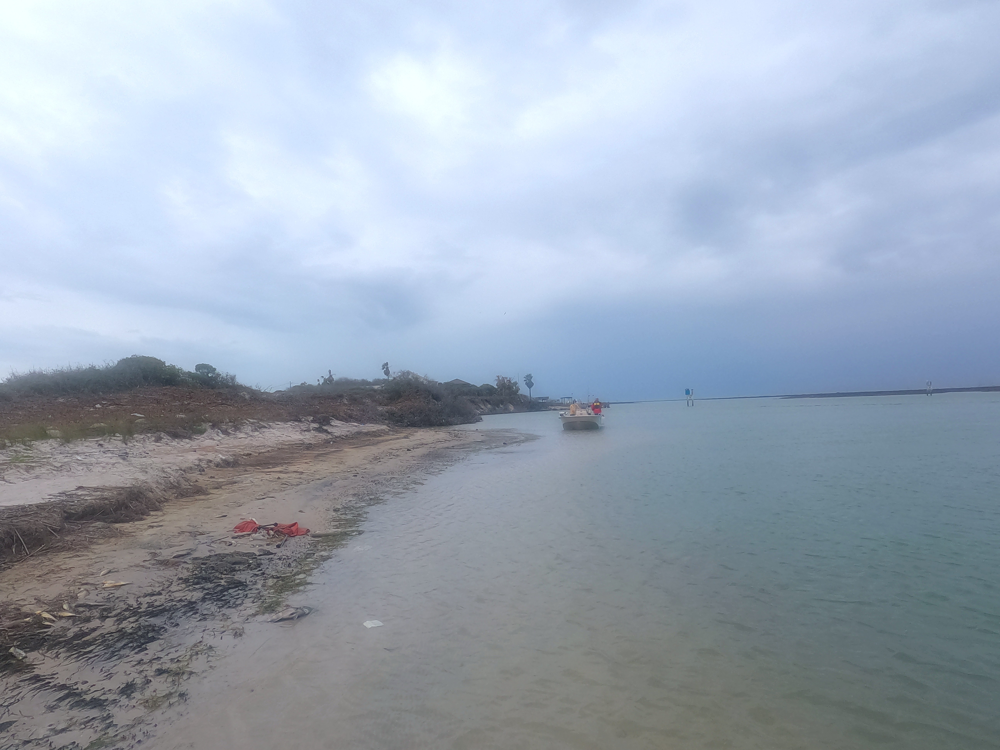
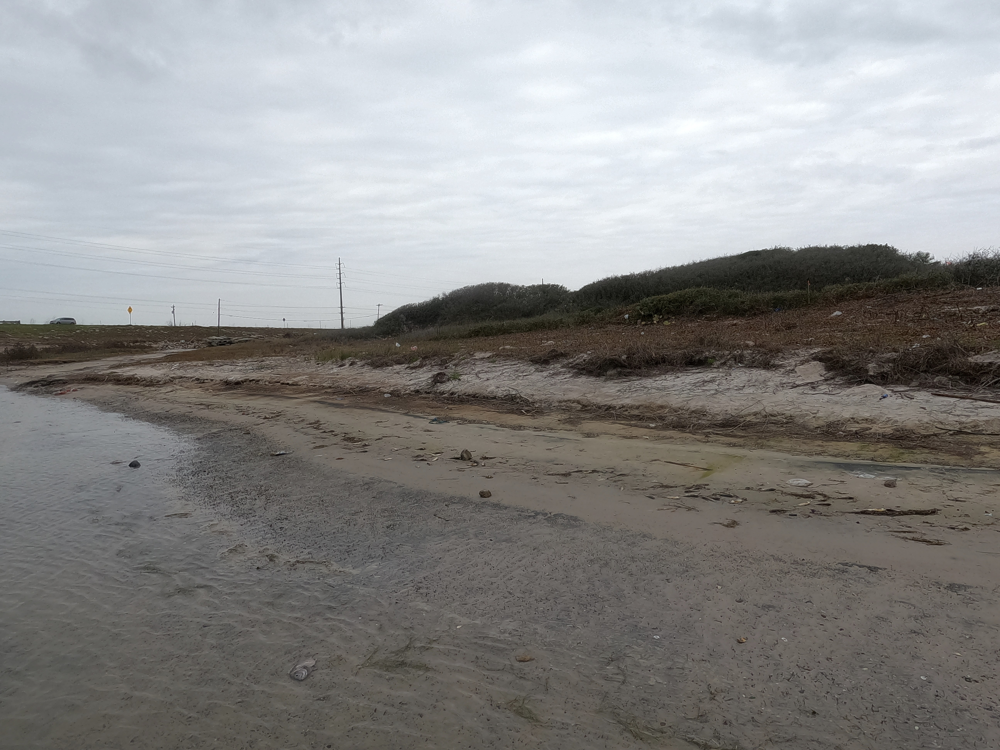
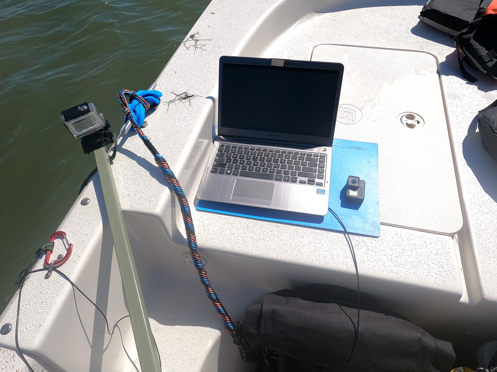
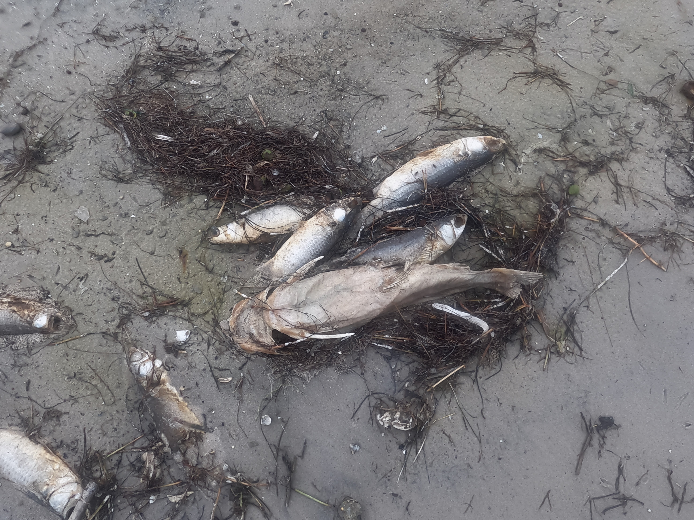
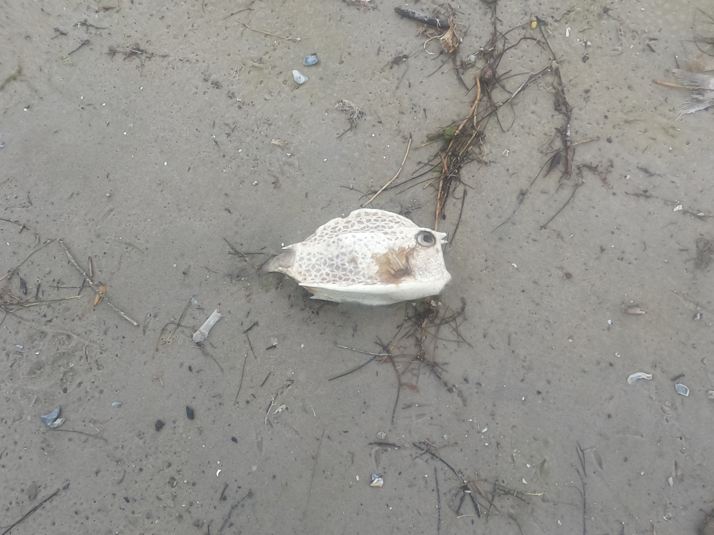

## EMILY Status

A quick recap of the EMILY's status: it is more or less operational. 
That is, the vehicle can follow waypoints using [ArduRover](https://ardupilot.org/rover/) and maintain a long-range radio connection to the GCS.
The RC controller is another major range limitation ( within ~20 feet) 
but the current plan is to rely on a gamepad for manual control that communicates through the GCS. 
Using the GCS middle-man for control is [reported to come at the cost of latency](https://ardupilot.org/rover/docs/common-joystick.html?highlight=gamepad), 
but flying vehicles are by far the primary Ardu concern. 
Given that the EMILY is going to act a slow-moving camera platform, it is expected (at least hoped) that the latency will be tolerable. 

The remaining issue is that the GCS does not receive an accurate voltage reading, so I am forced to make very short missions
to not risk depletion. The folks at [Lonestar UAS](https://lsuasc.tamucc.edu/) have encountered this issue, and had success with a better power module. 
I've simply not yet performed the minor re-soldering needed. A more fundamental stumbling block is that almost every lagoon trial
reveals some new issue. I have always been able to get a fix through a sequence of reboots, re-calibrations, barometric pressure calibrations... 
but occasionally the fix has been to simply replace the Pixhawk Mini with another. 
In fact, I seem to be swapping between three units that are somehow operational after enough time and firmware re-installs. 

Because of these reliability issues, I have been hesitant to perform any untethered missions. 
Ultimately, the goal is to have an autonomous explorer using onboard sensing and processing for opportunistic, adaptive missions. 
But that cannot happen as long as the vehicle is tied to shore. 
It is not of huge, immediate concern since I first want to simply collect a shallow underwater RGB dataset with the GoPro and 
spend some time developing algorithms for supervised and unsupervised learning as well as novelty detection. 
This leads to the current stage of the project: integrating the underwater GoPro with a companion computer for onboard processing
and collecting GoPro video from the Laguna Madre. 

## Underwater GoPro Streaming - Lab

[Last post](https://ekrell.github.io/laguna-madre-underwater-video/), I showed that I could submerge the GoPro from the side of my parent's fishing boat 
and record footage with recognizable sand, seagrass, and shells. 
However, since the boat's trolling motor was not working we could only navigate in the shallows by drifting until getting stuck.
To acquire a variety of data, I will need to collect with either a boat with trolling motor, kayak, or the EMILY itself. 
The first is ideal since I would be able to easily navigate over a coverage area and build an image mosaic. 
Using the EMILY requires confidence in the ArduRover integration, which I intend to work on in parallel with the algorithm development. 

Since the GoPro seems suitable for shallow-water vision-based missions, the next step was to stream the footage to a computer.
Using an onboard computer, the EMILY needs to process the underwater stream to make decisions. 
The GoPro Hero 4 excels at obtaining cost-effective underwater imagery, but is not the ideal choice for delivering the footage to a computer.
The choices are either WiFi or HDMI capture card and waterproofed connection to the camera ([costly](https://www.diveandsee.com/products/monitors-and-gopro/gopro-hero-7-underwater-housing-wifi-remote-control-capability-%20hdmi-live-streaming-video-cable-led-video-light)). 

WiFi is not generally effective underwater. In my trials, the connection is lost almost instantly on submersion. 
However, I found [this extremely cheap technique](https://www.paulillsley.com/GoPro_Underwater_Wi-Fi_Cable_Setup/) by Paul Illsley to deliver the WiFi signal directly from the camera to the onboard computer
using an RF cable. 

On the software side, GoPro does not support an API but has allowed the existence of [Konrad Iturbe' `gopro-wifi-hack`](https://github.com/KonradIT/goprowifihack).
This allows control of the GoPro over WiFi using HTTP requests and accessing the video stream. 
This stream is not the highest resolution that may be recorded, but the same preview stream used by the official GoPro smartphone app. 
A couple of weeks ago, Alexis Guijarro made public [`ros-gopro-driver`](https://github.com/TOTON95/ros-gopro-driver):
a convenient interface between `ros` and the GoPro that makes the stream easily accessible to applications using `opencv`. 
After testing that it would work with the GoPro Hero 4, I made a [pull request](https://github.com/TOTON95/ros-gopro-driver/pull/6) that updated the README with a quick-start guide to installation and use. 

Once the RF cable arrived, I used the underwater WiFi trick and `ros-gopro-driver` to stream backyard pool footage to my laptop: 

The GoPro Hero 4 stream is a bit blurry, but it only needs to be sufficient for onboard scene understanding. 
The camera can stream and simultaneously record to its SD card at the specified resolution. 
In the following video, the left recording is what was streamed to the laptop and the right is the 1080 res video recorded by the camera.
The difference between the two is more subtle than I expected. 

[Video comparison of streamed and recorded underwater footage](https://www.youtube.com/watch?v=3a1oJquOUrk)

## Underwater GoPro Streaming - Laguna Madre

With the pool success, I wanted to ensure that I could maintain a fairly long-term connection between GoPro and laptop out in the lagoon. 
Since the trolling motor has not been repaired, I did not collect useful data. But I streamed the GoPro to my laptop for almost half an hour
with no connection interruptions. Latency was stable (< second delay), and the laptop showed a continuous strong WiFi signal.
Having seen that the GoPro footage should be useful (but challenging) for computer vision and that the stream can reliably be 
delivered to an onboard computer, I intend to setup a Raspberry Pi or Odroid stream processing platform that I can deploy on the EMILY (eventually), 
and within a week or so on a kayak for initial trials and data collection. 

I am not sharing the lengthy recording since it almost entirely a green haze, but the following are photos from the outing. 

My parents and their Carolina Skiff: 

Packery Channel:

Computing station:

Casualties of the Texas freeze: 

And finally, a [video of a very simple scrambled eggs lunch](https://www.youtube.com/watch?v=LCfQwRSKnEo).
