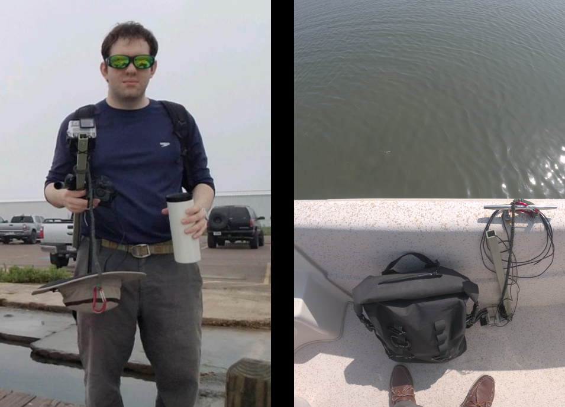
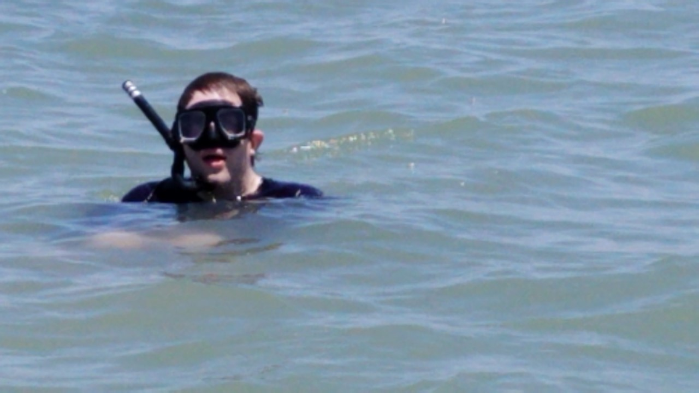

March forgot to go out like a lamb, as evidenced by the high number of small craft advisories issued this April. 
Yesterday I was staking the tomatoes to fortify them from the winds, but today was quite pleasant and a great opportunity for data collection. 
Once again using my parent's fishing boat, we spent the morning and afternoon on a combined fishing and data collection trip. 
Despite promising reports of trout and redfish, we had very little success with the former. However, I am satisfied with the underwater videos. 
 

The morning was foggy and blocking the sun such that there was no visibility through the water.
But around 10 a.m. the sun was shining and I recorded two videos. 
Previously, I reported that we were unable to navigate in the extreme shallows since the boat's trolling motor was not working.
It has been fixed and we were able to record in depths of ~1-2 ft. 

[Video: Laguna Madre seagrass (1/2)](https://youtu.be/5IZLlsfO9gs)

[Video: Laguna Madre seagrass (2/2)](https://youtu.be/Su0bXVFR2sU )

I suspect that viewers used to the crystal-clear waters of various travel destinations that are not the Laguna Madre will be surprised that I call these recordings satisfactory.
It is true that the turbidity is high and the images are both noisy and green. 
But much of the time the visibility is practically zero, so the ability to distinguish shape and texture of the seagrass is good. 
However this is not the best that it can be. There are times when I can look overboard and make out fine details of fish and crabs.
It is ideal for the autonomous vehicle to be either lucky or strategic enough to be surveying sites of interest under such conditions, 
but the expectation is that much of the survey data will look like these videos. 

As I have explained before, the goal is to develop a model that will allow the vehicle to classify what it sees based on the image clarity. 
Here, it should certainly be able to detect seagrass even if it cannot specify a species. Even better is if it could narrow down the 
set of likely species. These fuzzy maps could be used to direct future missions, to take advantage of better imaging conditions to sample
likely regions with species of interest. 

The winds kicked up a bit in the afternoon, stirring up the turbidity and reducing visibility again. 
I spent some time in the water, and observed that I could not even see the fingertips of my outstretched hands. 

