I spent the last two nights with my family at [Channel View Condominium](http://www.channelviewcondos.com/) in Port Aransas, Texas. The condo is steps from a pier that extends toward the Corpus Christi Ship Channel. It seemed as if the local pilot boat barely had time to dock before heading out again to see massive tankers safely in and out of the the busy waterway.

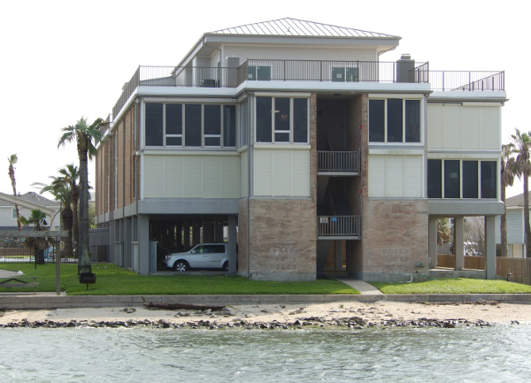

Always looking for opportunities to collect data, I brought the full underwater recording kit which includes the lab’s GoPro Hero 4 Black and my personal GoPro Hero 9 Black. There is a small beach that is more properly called an assemblage of rocks. These rocks, made treacherous by their coat of clinging, slippery seaweed, continue quite a long distance toward the channel. 

Closer to the gulf than where I am typically sampling in the lagoon, the waters here are slightly less turbid. On both days, I spent some time snorkeling and wading among the rocks with the GoPro Hero 9. Much of what I caught on film I was unaware of while out there since the camera was able to get a closer and clearer look at the submerged features. 

I am very pleased with the material collected. Most of what I have recorded in the Laguna Madre is either sand or seagrass, and with very little clarity. I am certainly aiming to develop a system that does more than simply distinguish between sand and seagrass. Here, I was able to discern detailed rock textures, several types of seaweed, fish darting across the camera, and even a whelk shell. To set the reader’s expectations appropriately, if I can actually see something in the video I consider it high quality. I am used to a blur where the existence of texture indicates seagrass. 

[Video 1: May 17, 2021](https://youtu.be/x80pp6fHQYk)

[Video 2: May 18, 2021 (Five clips concatenated)](https://youtu.be/7qaApC8IK3w)

The following are highlights from the second video. 

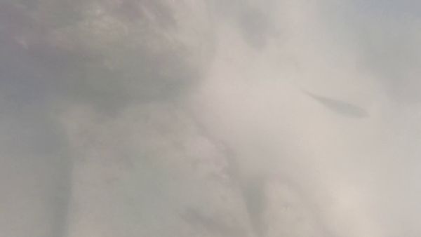

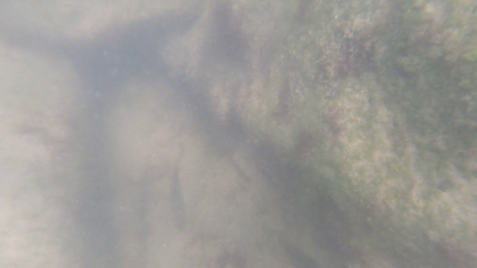

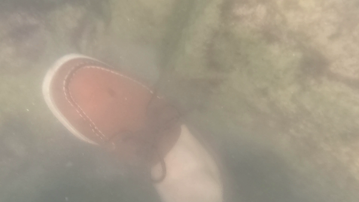

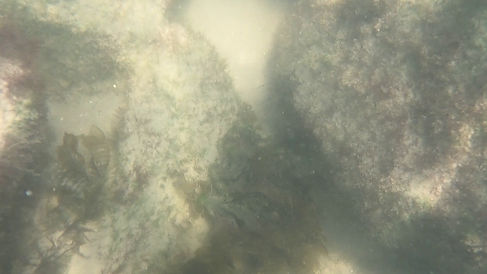

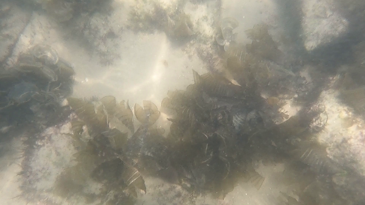

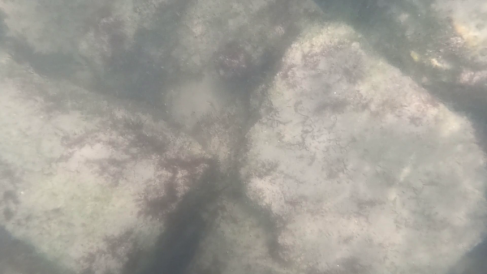

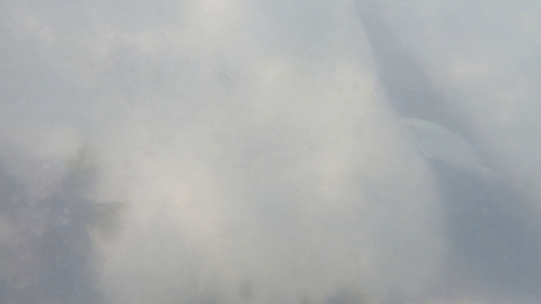

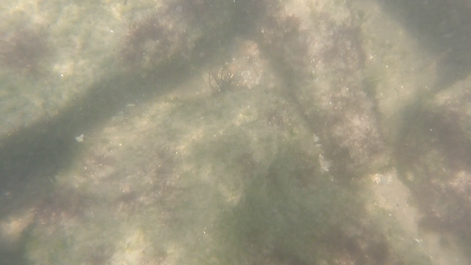

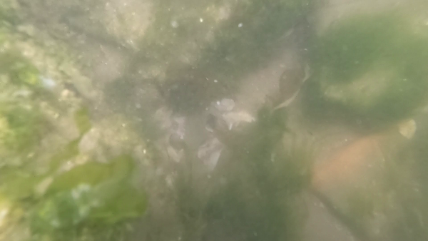

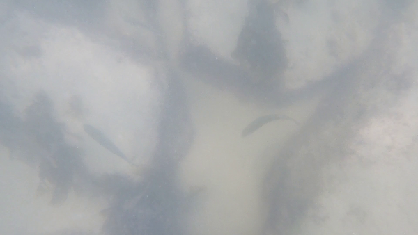

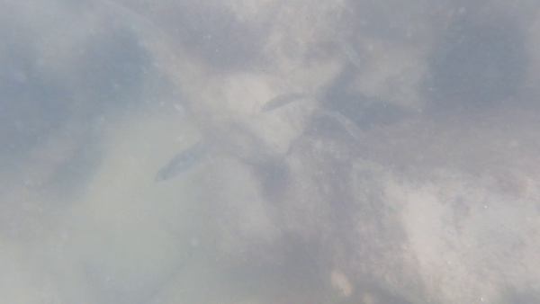

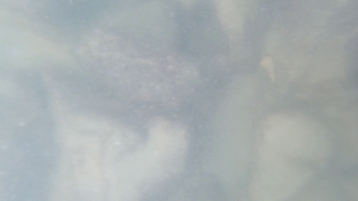

Off the subject research, here are other pictures and video taken over the short Port A trip. To save the reader some time, I suspect that only the first video, the thunderstorm, has broad appeal. In the interest in brevity I will say that (1) we had a wonderful time which was at its height when enjoying a late night cocoa while the storm rolled in: the bright green artificially lit water, thunder-lit sky, and the combined sound of ocean waves and stormy gusts. Also, (2) we caught a number of small fish in addition to three keeper spotted trout that served as dinner. 

[Video: night thunderstorm over the lit pier](https://twitter.com/krell_evan/status/1394869829081915395)

[Photo gallery](https://photos.app.goo.gl/KL1zgyUtVhTySSBo8)

[Video: night falls on the rocky beach, just outside the condo](https://youtu.be/mM7OrfdPPbU)

[Video: tug Arctic Discoverer dwarfs surroundings](https://youtu.be/CxkPFfm-I1o)
