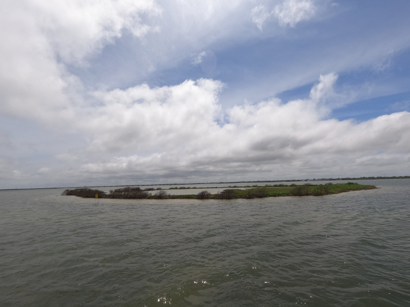

|  | 
|:--:| 
| [Spoil Island (link to higher res)](https://twitter.com/krell_evan/status/1398886366386298880) |

[Video of another spoil island](https://twitter.com/krell_evan/status/1398751184534581248)

This morning's outing was delayed by unexpected stormy weather. We eventually set out from the marina at 1:30 pm instead of the planned 8:30 am. 
Even then, we experienced moderate rain for the first half hour or so. This outing was primarily a fishing trip, 
but I always come prepared for opportunistic data collection. 
The overcast skies severly limited the visibility, 
but I recorded while we trolled among the shallows nonetheless. 

[GoPro video](https://youtu.be/i5WRzOhVeB4)

It is too hazy to discern details for much of the footage. In the shallowest regions, the recognizable seagrass texture can be seen. 
However, there is a segment where you can see hazy brown patches of brown. Given that it comes after a couple minutes of obvious brown seagrass footage,
there might be an opportunity to use the recent past to make a rough guess at the poor quality present. 
That is, I can imagine the boat using a Bayesian model to assume that those brown patches are further seagrass patches since it was just passing over similar color patches in the shallower waters nearby. 

With low clarity recordings being the bulk of the collection, I may choose to only post higher quality videos to the blog from now on. 

-------

I have created a [Google Map of all the GoPro recording locations](https://www.google.com/maps/d/edit?mid=1ikjTzJSn8ZHcMEG60Y72kDa2iIK9PM3i&usp=sharing) and added the link to the blog's menu at top. 
My problem with it is that it does not clearly tell you which feature was used for the colorbar. 
You see "2- 2" but without the important information that this means that there are two instances where the visibility is a "2". 
(The visibility rankings are just my own quick assessment on a 1-10 scale where 10 is the best. That I gave the best so far a six is possible overoptimistic -- as if there are actually 4 better situations for me to still find.)
