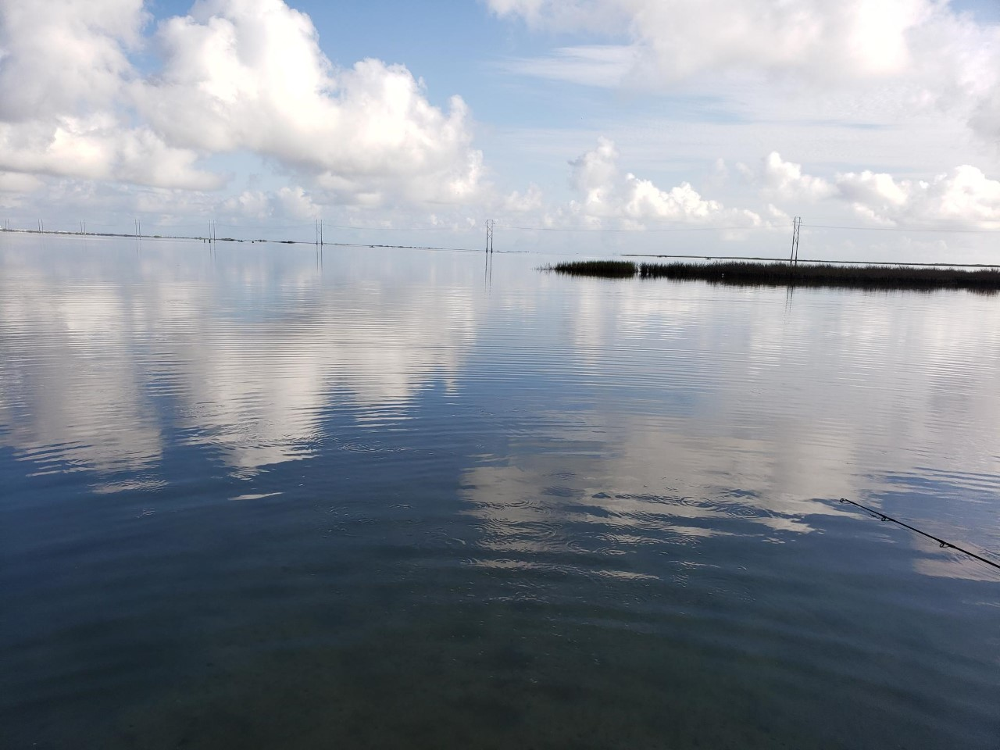
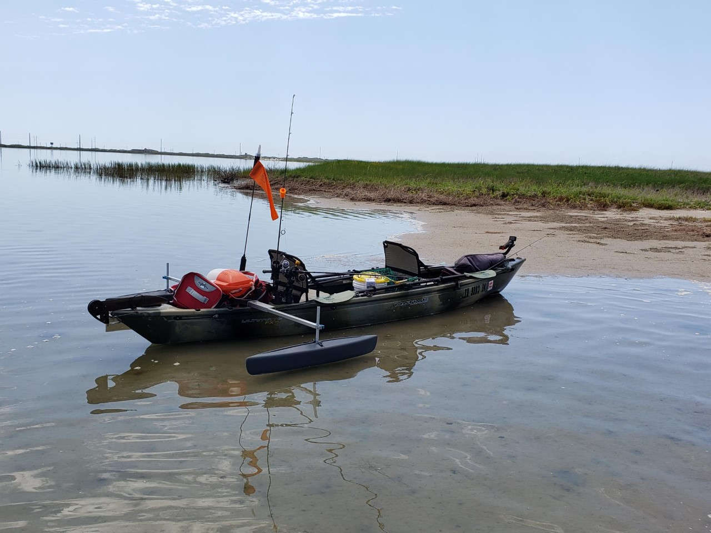
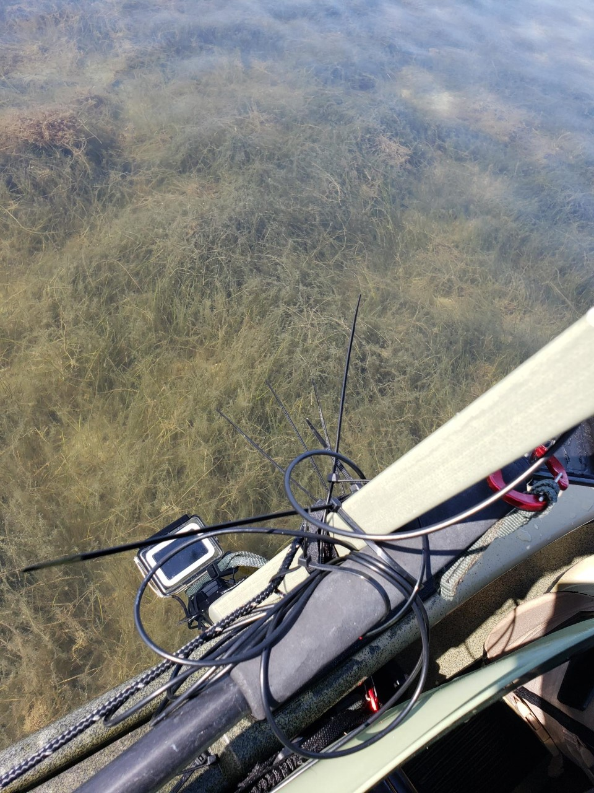
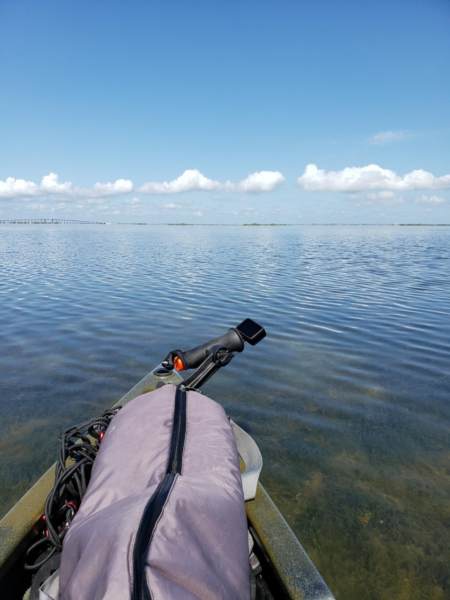

Until now, I have recorded [several underwater GoPro videos](https://www.google.com/maps/d/u/0/edit?mid=1ikjTzJSn8ZHcMEG60Y72kDa2iIK9PM3i&ll=27.65407068056824%2C-97.18341999999998&z=11) all of which are plagued by turbidity to some degree. Even the [clearest](https://ekrell.github.io/rocks-port-aransas/) was only visible for the submerged GoPro. I myself could see very little detail wading around rocks just a few meters off the beach. However, I know from experience that there are days with extreme clarity where one can drift in a kayak for miles and make out individual fish, shells, seagrass species, prop scars, etc. These days are near-windless, sunny, and most prevalent in summer. It is quite possible for high-wind weeks to go by and suddenly becalm for a perfect flat-water day. Today was finally that day. 

|  | 
|:--:| 
| Launch spot ([27.6415, -97.2026](https://www.google.com/maps/@27.6411645,-97.2043261,608m/data=!3m1!1e3)) |

A kayak is a very suitable vessel for shallow-water sampling. Soon we will use the EMILY for this, but for now we need to be targeted in the data collection effort and intentionally set ourselves up to drift slowly over shallows with a variety of substrates. As usual, data collection and fishing were combined. My dad and I set out from a kayak launch spot near Packery Channel Park, [a spot we use frequently for EMILY testing](https://ekrell.github.io/manual-test/). Long before I was working with underwater imagery, we kayaked in these waters on a similar day and observed incredible diversity and detail. Today’s goal was to collect some higher quality imagery for machine learning, and to demonstrate that opportunities for low-turbidity underwater sampling do exist. 

In addition to the usual underwater GoPro Hero 4 rig, I deployed an overhead-view GoPro Hero 9. The clarity was such that you can see very well from the boat, so I was interested in how useful the overhead data would be. Good imagery could, for example, motivate the use a low-flying aerial vehicle for faster, larger scale sampling. 

I was able to record, by far, my best underwater data. However, the HD footage filled the 16GB SD card after 35 minutes. The resulting data is largely of seagrass, but I am quite pleased with the variety of species that can be seen in detail. Also, minnows frequently dart across the screen, providing opportunity to test motion detection w.r.t. the camera/boat motion. 

[Video: (Underwater) Laguna Madre - 2021/06/13 - extreme clarity](https://youtu.be/HfisJm9n5yk)

I was able to collect a larger volume of data with the above-water GoPro Hero 9. This recording also has excellent detail. The wider angle of the elevated view provides a larger field of view that increases the probability of detecting interesting features. Another advantage is that it does not suffer from being too close to the subject. In previous field trials, the underwater view was affected by harsh motion blur since the surface could be extremely close to the camera. It is not uncommon for grasses to contact the camera. However, the overhead view does not pick up on some of the finer details that appear in the underwater view. But more obviously, the light reflected off of the motion of the water causes a warped, undulating image. 

[Video: (Above Water) Laguna Madre - 2021/06/13 - extreme clarity](https://youtu.be/N9gpic8N0I0)

I can imagine the two views working well together. An autonomous boat equipped with both could use the overhead camera for a coarse, wider view to detect targets and control the steering of the vessel to capture it in more detail with the underwater camera. For example, the underwater camera would extremely lucky to film this [Bay Nettle jellyfish that I was able to easily spot from the boat and record with my phone](https://twitter.com/krell_evan/status/1404227879727255554). 
