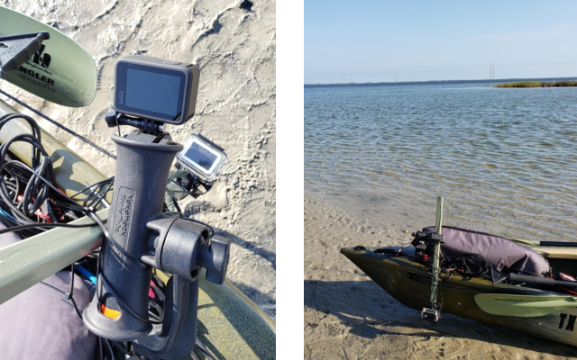
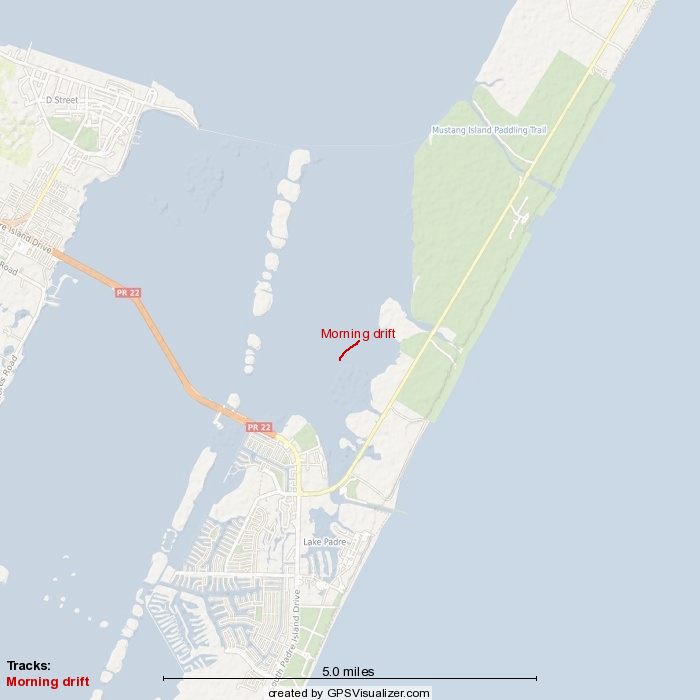
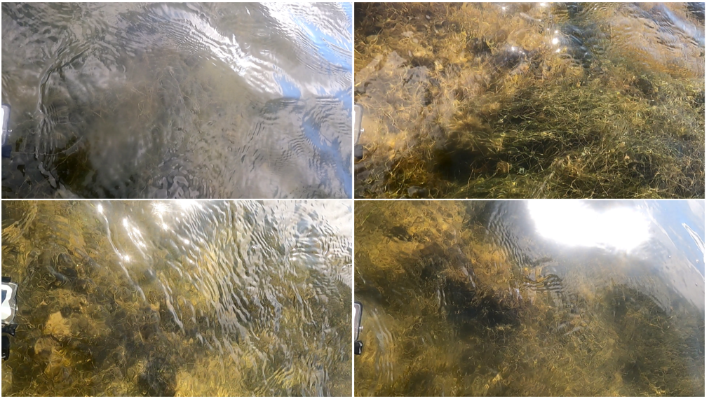

Given Sunday’s [high clarity recordings](https://ekrell.github.io/extreme-clarity/), we set out again while conditions remain favourable. Today was a little windier than the complete calm of Sunday. We have no onboard anemometer, but the weather report indicated ~11 mph. A subtle, but steady, ripple appeared on the water surface. It was still very easy to make out underwater details, at least for the shallows targeted by this project. 

|  | 
|:--:| 
| GoPro Hero 4 and 9 mounted for underwater and above-water views |

I made a slight modification to the GoPro setup. Before, the underwater GoPro Hero 4 was attached portside and the Hero 9 starboard. But I am very interested in comparing the view from each camera, so I positioned them on the same side with some overlap. I had to angle the above-water camera to avoid having the submerged camera take up too much of the view. The setup is currently a very crude zip-tie job (I know - single-use plastics - but I do [re-use them](https://www.instructables.com/How-to-Reuse-Zip-Ties-1/)). 

Two recording sequences were made, one in the morning (~9:30 AM) and another in the afternoon (~12:30 PM). The morning footage was obtained by deploying a drift anchor to capture steady, clear imagery as best as possible despite the very shallow water. Recall that, while shallow water is targeted because it can be seen from a surface vehicle, the motion blur can be substantial. 

[Morning footage](https://www.youtube.com/watch?v=hMgJT-kqP-0)

By noon, the wind increased slightly but with obvious impact on the water clarity. The turbidity was noticeable, but overall clear enough for distinguishing several distinct seagrasses and seaweeds. We recorded in the most shallow region so far. Here, the camera was among the grasses rather on above them. We also encountered several thick sargassum masses, halting our drift and forcing us to paddle. At one time, a bag flew out of the kayak and we had to maneuver to recover it. Thus, there are several moments where the footage becomes jerky and blurred due to paddling instead of drifting. 

[Afternoon footage](https://www.youtube.com/watch?v=YB9ZufZUn_4)

Where the increased, but still relatively low, wind speeds only slightly diminished the underwater film quality, the above-water footage was significantly worse than on Sunday. Below is a selection of screenshots that show sun glint and ripples severely obscuring the view of the surface. Unless I can mitigate this with hardware or software, I do not intend to keep recording the above-water view except in the calmest of conditions. Since Sunday, I have been developing ideas to take advantage of both above and below views for autonomy, but the lack of usable footage at ~11 mph is not very promising. The upside is that I can avoid processing, storing, and uploading two videos for every recording event. 

