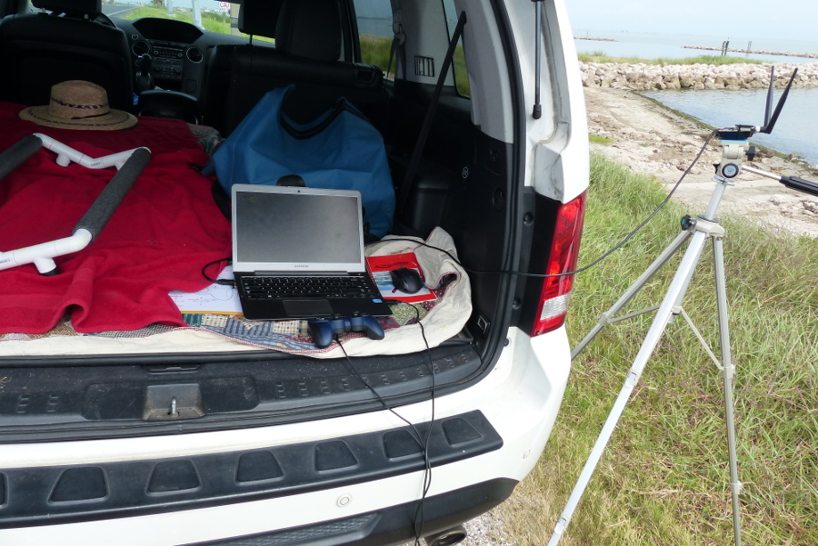

## Lab

Ardurover supports controlling vehicles using a [gamepad/joystick](https://ardupilot.org/rover/docs/common-joystick.html) instead of the conventional RC setup. Using RC means that there two communication links between the user and vehicle. The telemetry link from the GCS (laptop) and the RC link to the RC transmitter (here, the [Spektrum DX8](https://www.spektrumrc.com/Products/Default.aspx?ProdId=SPM8800)). I previously have reported achieving very low ranges and unreliable connection with both links. This motivated the [switch to long-range telemetry](https://ekrell.github.io/rfd900x/). However, a weak link was still the RC transmitter. By switching to a gamepad hooked up to the laptop, all communication is through the long-range telemetry. When we were loaned the EMILY by [CRASAR](http://crasar.org/), their setup was also a gamepad so I assume that they also concluded that the gamepad was more effective. Another motivating factor to switch to the gamepad is that the DX8 transmitter has mysteriously vanished. A possible disadvantage of gamepad control is that there is lag associated with control over telemetry vs over RC. The ArduPilot documentation warns against using a gamepad without a backup RC link. However, I suspect that this is more critical for an aerial vehicle. 

The gamepad is a [Logitech Dual Action](https://www.logitech.com/lang/pdf/dual_action.pdf). I enabled gamepad control in QGroundControl and choose button mappings. The logic behind the mapping is to keep similar functions together. __hold__ and __loiter__ are both shoulder triggers to reactively halt the vehicle. Start and select are __arm__ and __disarm__ such that the start button is essentially _on_. __RTL__ and __Smart RTL__ are together on the directional pad, etc. 

It was not enough to enable to gamepad. The servo values transmitted for thrust did not match up with what the vehicle needed. Specifically, the idle (centered joystick) value was sending a signal to apply thrust. I would have had to hold the stick down for the boat to stop moving. At the risk of making the RC control no longer operate, I modified the parameters for servo output on channel 3.  I am not updating the EMILY parameters GitHub repo until I know how this effects the RC control, but I will follow up with the settings I used. 

| **parameter**   	| **change** 	|  
|-------------	|------------	|
| `SERVO3_MAX`  	| 1900   -->  1900     	|
| `SERVO3_TRIM` 	| 1500   -->  1000     	|
| `SERVO3_MIN`  	| 1100   -->  900      	|

I made a button layout reference by modifying one from the [ArduSub documentation](http://www.ardusub.com/getting-started/initial-setup.html). I uploaded the [`.xcf` file](https://github.com/ekrell/emily-usv/blob/master/logitech_button_layout.xcf) so that you can replace the labels with your own. 

#### Quick GoPro mount

Since the EMILY has been reliable the past few missions, I have been thinking about the camera aspect. Again, the purpose of this project is to use the underwater camera-based onboard classification to control the shallow-water sampling mission. In parallel, I have been working on the autonomous control of the EMILY and building a local GoPro underwater imagery dataset using manned vehicles (motorboat and kayak). Next, I want to collect data with the EMILY itself so that I can figure out a good way to mount the camera. Concerns are (1) how and (2) where to mount the camera. Since the seagrasses and other entities will typically be **very** close the camera, the boat needs to go slow. The EMILY is designed as a speedboat for life-saving operations. With manual control, I have found that I have to apply considerable thrust to achieve steering. Not at all like the trolling motor I use on the motorboat, where maneuvering can be achieved at very slow cruising. This is a worry for the near future. First, where to mount the GoPro. I have found that I can simply zip tie it to the kayak without noticing any effect on maneuverability. So I simply did the same on the EMILY, with hideous abuse of zip ties. But I suspect that the ratio of EMILY size to GoPro mount will be such that it moves like having a paddle in the water. 

## Field

|  | 
|:--:| 
| My dad at TAMUCC's University Beach |

[Video demonstration](https://youtu.be/Z66jPl3pTmg)

This morning, I tested the gamepad control and GoPro mount out at [Texas A&M University – Corpus Christi’s University Beach](https://cbi.tamucc.edu/CHRGIS/University-Beach/) with the help of my parents. In short, the gamepad control worked as expected. I found it easier to change modes using the buttons rather than the RC switches. Sometimes, the lag was noticeable. There was occasionally some delay before thrust was applied. I experienced no issues with the GCS/EKF errors, etc. 

However, the GoPro mount made it very difficult to control. To travel straight, I had to keep steering to the left to counter the effect of the GoPro extended out into the water on the boat’s right. As expected, more work will be required for a usable camera solution. 

|  | 
|:--:| 
| Ground control station |

|  | 
|:--:| 
| Deploying the EMILY |
