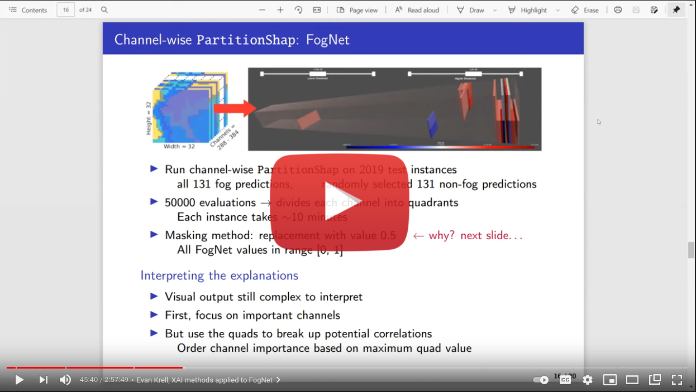
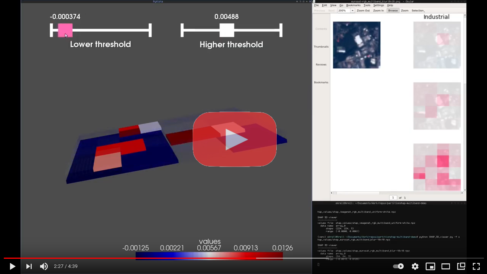

Several weeks ago, the title of this blog was changed to _Evan Krell’s Coastal AI & Autonomy Blog_ to suggest a wider scope of content than just marine vehicles. 
At the end of last summer, the EMILY was almost ready for autonomous missions. Since then, the vast majority of blog posts focus on data collection performed 
through manual means: my parent’s fishing boat, kayak, and snorkeling. All are valid for collecting the data that will be used to train the machine learning 
systems behind the EMILY’s data-driven navigation. Progress on the EMILY itself has been on hold until last week, 
when I [switched to gamepad control](https://ekrell.github.io/gamepad/) to take advantage of the long-range telemetry for both GCS and manual control. 
The lack of progress with the EMILY is because I was recently put on a project such that my dissertation has entirely changed. 
Work on the EMILY is, for the time being, a side project. 

In Spring 2021, I joined the [NSF AI Institute for Research on Trustworthy AI in Weather, Climate, and Coastal Oceanography (AI2ES)](https://www.ai2es.org/). 
The institute involves several universities, industry partners, government labs, etc. One of the major components of trustworthy AI addressed by the institute 
is explainable artificial intelligence (XAI): research into techniques that can shed light on why complex machine learning models produce the predictions that 
they do. An introduction to the topic can found in a 2019 paper by AI2ES PI Dr. Amy McGovern:
[Making the Black Box More Transparent: Understanding the Physical Implications of Machine Learning](https://journals.ametsoc.org/view/journals/bams/100/11/bams-d-18-0195.1.xml). 
Another great resource is Christoph Molnar’s online book [Interpretable Machine Learning](https://christophm.github.io/interpretable-ml-book/) 
that explains the major XAI algorithms in detail along with their advantages and disadvantages. 

My role in AI2ES is research in XAI for deep learning models applied to coastal applications, working under AI2ES co-PI [Dr. Phillip Tissot](https://cbi.tamucc.edu/philippe-tissot/) and [Dr. Scott A. King](http://faculty.tamucc.edu/sking/). 
Specifically, I am working on techniques to explain Kamangir et al.’s 
[FogNet: A multiscale 3D CNN with double-branch dense block and attention mechanism for fog prediction](https://www.sciencedirect.com/science/article/pii/S2666827021000190). 
For 24-hour lead times, the input data for FogNet is a raster with 384 bands of meteorological/atmospheric features related to fog. 
The goal is to get some insight into how FogNet uses this data to make fog predictions: what strategies for fog prediction has it learned? 
Do these meet the expectations of domain experts? If not, are the strategies naive or has the model detected unknown patterns relevant to fog? 
The vast majority of XAI techniques for CNNs produce explanations as 2D heatmaps that show which pixels spatially were relevant to the prediction. 
For example, an image classification example might show a strong signal for parts of a cat’s face if the prediction is cat. 
However, such a 2D explanation is not satisfactory for FogNet. Just knowing that certain pixels along the coast does not reveal why: 
was it sea surface temperature, atmospheric pressured, etc. Thus, we are interested in explanations that tell us about the important of specific bands: 
channel-wise explanations. 

[SHAP](https://github.com/slundberg/shap) is an XAI technique that uses game theory to fairly assign to each feature the contribution it made towards the output prediction for a single instance. [PartitionShap](https://shap.readthedocs.io/en/latest/example_notebooks/image_examples/image_classification/Image%20Multi%20Class.html) is an implemenation of SHAP that can be used to explain image-based models by treating superpixels as features. Because of the fairness guarantees made by SHAP, it is an appealing choice for XAI. I have extended PartitionShap to partition along the raster channels for a new version called Channel-wise PartitionShap. This is implemented as an optional argument when using PartitionShap and is currently available in the Conrad Blucher Institute’s [SHAP fork](https://github.com/conrad-blucher-institute/shap). I’ll not explain Channel-wise PartitionShap in detail here, since I presented on the method for the AI2ES short course [Trustworthy AI for Environmental Science (TAI4ES)](https://www2.cisl.ucar.edu/tai4es). Visit the link to access the slides and recordings. I presented on day 4. 

The following is an index of progress with Channel-wise PartitionShap: 

- Conrad Blucher Institute’s [SHAP fork](https://github.com/conrad-blucher-institute/shap).
- [Google colab notebooks](https://github.com/conrad-blucher-institute/partitionshap-multiband-demo) that compare default and Channel-wise on three models.
- A prototype 3D visualization tool, with a [video demonstration](https://www.youtube.com/watch?v=kNFY6ff996E).
- REU students Josh Friesen and Julianna Judge are working with Channel-wise ParitionShap to explain simpler models where we have an expected explanation as well as adding features to the 3D visualization tool. They presented a poster at the AI2ES Summer 2021 retreat event at the Lexington in Corpus Christ, Texas. [See local news coverage here](https://www.kiiitv.com/article/news/education/artificial-intelligence-conference-for-weather-forecasting/503-b20fe6b7-2866-4d03-b2c6-f0a5791c26db). 
- Presented initial results in explaining FogNet at the TAI4ES short course
	- [Day 4 recording](https://www.youtube.com/watch?v=xLrUtNIFhVM&t=1982s)
	- [Slides](https://drive.google.com/file/d/1YPUYy86ELq2GE45Z83LUzBHdpGuDP4sQ/view?usp=sharing)
- Manuscript submitted (under review) that includes initial FogNet XAI results.

