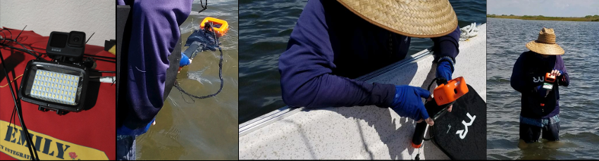
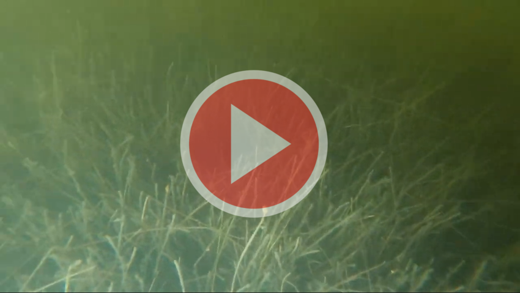

---
layout: post
title: Illuminating seagrass below the boat
category: GoPro, field, laguna madre, dive light
--- 

The ideal vessel to capture quality video of the shallow seafloor would be slow and steady to achieve clear, stable imagery. 
The EMILY was designed to speedily come to the aid of drowning victims, not perform data collection transects. 
However, the strong influence of wind and water currents requires a somewhat powerful boat. 
My attempt to build an airboat powered with a rotated quadcopter was successful in a pool, but could not overcome the environmental forces. 
So, I am very much wishing to make progress with the EMILY since it maneuvers very well, is of far greater quality than my DIY vehicles, 
and I've invested substantial time into the autonomous control. 

The next step with the EMILY is to mount the GoPro below the waterline and record seafloor imagery to train machine learning algorithms 
to discriminate between various substrates and perform novelty detection. If I put the camera at the stern, it will be affected by the wake produced.
The bow moves up as the boat gains speed, so that the height to water surface is variable. 
If attached to the sides, it acts as a paddle in the water and I have shown before that it greatly impedes maneuverability. 

I have been considering the use of artificial illumination so that I can mount the GoPro directly under the boat, 
where I believe that it will least impact EMILY's dynamics and should remain at a relatively stable depth. 
The ability to see anything in the lagoon is greatly affected by the sunlight. In my previous outings with a GoPro attached to a kayak,
I had to make sure that it was mounted on the side not in the kayak's shadow.

I purchased a [Neewar 60-LED dive light](https://www.amazon.com/Neewer-Underwater-Dimmable-Waterproof-Included/dp/B07HHZ76ND/) that has two brightness modes as well as a strobe function. Today, I took it out with the family's fishing boat to
see how well it illuminates the shallow seagrass below the boat. 
Since I haven't mounted the GoPro and dive light on our boat, this meant anchoring in the shallows, disembarking, 
and manually placing the lit GoPro setup under the boat. The images at the beginning of this post show the dive light with camera and the highly technical methodology of today's test. 
Not show is when I was actually underneath the boat, arm outstretched to get the camera as isolated as possible from any available natural sunlight. 

## Today's recording

The video features two clips. The first was taken with the dive light on full brightness, beneath the boat. If the light were not on, no seagrass would be visible.
Here, it is clear that the seagrass in visible is detail. I can imagine training a classifier with a suitable number of images of a variety of species
under these conditions. Another plus is that the illumination is from a source that can be held constant, rather than the variable sunlight. Initial attempts 
at classification showed that sun glint made it challenging to learn from images collected at different times. 

In the second clip, the strobe light is used to compare with and without the light. Obviously since seagrass is visible without, it was not taken directly under the boat,
but in the shadows cast by it. Here, there is some loss in color features becoming desaturated by the bright light. But, much texture is visible and the view penetrates further. 

