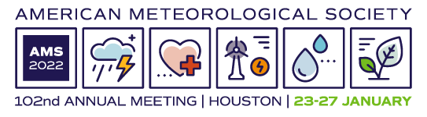

---
layout: post
title: Presented Channel-wise PartitionShap at AMS2022
category: AMS, conference, presentation
--- 

Last week, I presented a talk at the (virtual) 102nd American Meteorological Society Annual Meeting: [_Explaining Complex 3D Atmospheric CNNs Using SHAP-Based Channel-wise XAI Techniques with Interactive 3D Visualization_](https://www.researchgate.net/publication/358233206_Explaining_Complex_3D_Atmospheric_CNNs_Using_SHAP-Based_Channel-Wise_XAI_Techniques_with_Interactive_3D_Visualization).
This is part of an ongoing research effort in applying explainable artificial intelligence (XAI) techniques to help understand a complex deep learning model for coastal fog prediction [**FogNet**](https://gridftp.tamucc.edu/fognet/). 
This project is by [The Conrad Blucher Institute for Surveying and Science](https://www.conradblucherinstitute.org/) and is part of the larger XAI research effort of the [NSF AI Institute for Research on Trustworthy AI in Weather, Climate, and Coastal Oceanography (AI2ES)](https://www.ai2es.org/).

I have previously blogged about this research work [here](https://ekrell.github.io/ai2es/). Recent work includes:

- [Added datasets to the FogNet repo](https://github.com/conrad-blucher-institute/FogNet)
- [Performed XAI on FogNet, leading to creation of a repo for visualization tools for XAI on raster-based models](https://github.com/conrad-blucher-institute/xai-raster-vis-tools)
- [Added a Channel-wise PartitionShap demo on a storm prediction model](https://github.com/conrad-blucher-institute/partitionshap-multiband-demo/blob/main/PartitionSHAP_tornado.ipynb)

This blog largely focuses on my work with autonomous surface vehicles: [PID tuning in the field](https://ekrell.github.io/PID-tuning-EMILY/), 
[path planning publications](https://ekrell.github.io/acc-2020/), 
[collecting underwater image datasets](https://ekrell.github.io/extreme-clarity/), etc. 
These posts have slowed down over the last year due to the current focus on XAI which does not have the same blog post appeal as pictures of boats and sea creatures. 
This semester my primary goal is to publish a paper related to Channel-wise ParitionShap and FogNet. But I am hoping to spend some time testing out the [underwater light](https://ekrell.github.io/light-test/) for autonomous missions with the EMILY USV. 
Also, we have a manuscript on USV path planning using visibility graphs combined with particle swarm optimization. The paper is undergoing _major revisions_ after the first round of reviews. 
